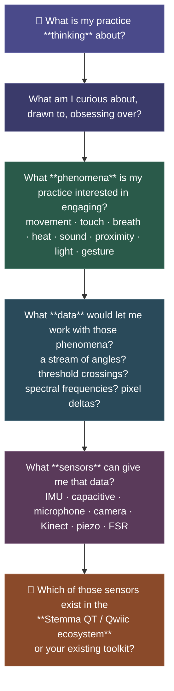

# Hardware Clarifications — Thinking Toward Sensors

---

## First: A Quick Vocabulary Fix

You may have heard the terms **Stemma QT** and **Qwiic**  and **Grove** in lecture and wondered if they're different systems you need to choose between. They aren’t, really. There are some subtle differences between them, besides name, but they are types of either 3 prong or 4 prong connectors.

![[5056-04.gif]]

**Stemma QT** (Adafruit) and **Qwiic** (SparkFun) are two brand names for the same electrical standard: a 4-pin JST-SH connector running I2C communication at 3.3V. The physical connector is identical. The electrical protocol is (nearly) identical. A Stemma QT cable plugs into a Qwiic board and vice versa, witt little to no modification needed.

---

## What Even Is a Sensor?

![[Pasted image 20260331221722.png]]

Here is a working definition for this course:

**A sensor is anything that transduces a physical phenomenon into data your system can process.**

That definition is deliberately broad. It includes:

- An **accelerometer/IMU** that reads movement, orientation, and vibration
- A **capacitive touch sensor** that reads electrical conductance at discrete points
- A **microphone** that reads acoustic pressure over time
- A **webcam** that reads light as a 2D pixel grid at some frame rate
- A **Kinect or depth camera** that reads spatial distance and skeletal pose
- A **GSR (galvanic skin response) sensor** that reads electrodermal conductance as a proxy for physiological arousal
- A **piezoelectric disc** that reads mechanical deformation (pressure, impact, vibration)
- A **GPS module** that reads position in space relative to satellites
- A **light sensor** or **color sensor** that reads photon flux at various wavelengths
- A **flex sensor** that reads bend angle as changing resistance
- A **game controller** that reads button states, thumbstick positions, and rumble signals

Notice that *microphone*, *webcam*, and *Kinect* are in that list.  They are sensors too!  

> [!question]- What about computer vision — does it count?
> If you're using a webcam with software like **MediaPipe**, **Wekinator**, or **OpenPose** to extract gesture, pose, or facial landmarks, you're running a sensor *and* an interpretation layer on top of it. The sensor (webcam) reads raw pixel data. The model reads that data and outputs a higher-order description (hand position, skeletal angle, detected emotion). Both layers involve reduction and both layers are legitimate sites of creative and critical inquiry.

> The question to ask is: *what does the model's interpretation assume about bodies, movement, and legibility?* Who was the training data? Whose gesture gets read cleanly, and whose doesn't?

---

## The Framework: Start from Practice, Work Toward Hardware

An early pain point, as we have discovered together, is in approaching physical computing for the first time by starting with the sensor. *So lets work backwards to the sensors starting with the thinking and curiosity!*

Working in this order will help keep your practice in the driver's seat. The sensor becomes an epistemic tool you've *chosen for a reason*.

---

## A Few Sensor Pathways (to Make This Concrete)

**If your practice is drawn to movement, gesture, dance, or the body in space:**
→ You're probably interested in orientation, acceleration, or spatial position data
→ Consider: IMU/accelerometer/gyroscope (Stemma QT options: LSM6DS3, LSM9DS1, BNO055), depth camera (Kinect, Intel RealSense), MediaPipe pose estimation via webcam
![[2472-04.gif]]

**If your practice is drawn to touch, contact, material surfaces, textile, or skin:**
→ You're probably interested in discrete contact events, pressure, or capacitance data
→ Consider: MPR121 capacitive touch (Stemma QT), FSR (force-sensitive resistors, any), piezoelectric transducers, velostat/conductive fabric
![[2340-00.gif]]

**If your practice is drawn to sound, voice, sonic environment, acoustic space:**
→ You're probably interested in amplitude, frequency content, onset events, or spectral shape
→ Consider: electret microphone + breakout, MEMS microphone (Stemma QT: PDM microphone), field recorders into audio analysis software, FFT in Max/MSP or TouchDesigner
![[Pasted image 20260331222131.png]]

**If your practice is drawn to proximity, presence, or environmental sensing:**
→ You're probably interested in distance, occupancy, or ambient conditions (temperature, light, humidity)
→ Consider: VL53L1X time-of-flight (Stemma QT), APDS-9960 proximity + color (Stemma QT), PIR motion sensor, thermal camera (AMG8833 grid-eye, Stemma QT)
![[3967-05.gif]]

**If your practice is drawn to biological states (stress, arousal, breath, heartbeat):**
→ You're probably interested in physiological signals as data (GSR, pulse, respiration, heat rate)
→ Consider: GSR sensor + voltage divider, MAX30102 pulse oximeter (Stemma QT), piezo on chest or wrist for breath/heartbeat, stretch sensor
![[Pasted image 20260331222533.png]]

***Not an exhaustive list of pathways, but it is a start!***

---

## Your Prompt

Before we discuss specific hardware purchases or setups, answer these questions. Write them in your Critical Technical Journal if you’d like, or bring them as notes to discuss in class or in a message to me (the instructor).

> **1. What is your practice thinking about right now?**
> Not what you want to make — what is your practice *interested in*? What questions, materials, bodies, phenomena, histories, or tensions keep pulling your attention?

> **2. What are you curious about in terms of physical phenomena?**
> Movement? Contact? Sound? Environmental change? Biological states? Something else? More than one thing is fine.

> **3. What kinds of data would let you work with those phenomena?**
> Try to be specific. Not "sensor data," but *what kind* of data? A stream of numbers? Threshold events (on/off)? A spatial map? A frequency spectrum?

> **4. Make a list.**
> Based on your answers above, write a rough list of the types of data you think you need. Don't worry yet about whether a sensor exists for it. Just name what you want to know about the physical world.

> [!mportant] Once you have that list, we can map it to available sensors, identify what's accessible via Stemma QT / Qwiic, and figure out a reasonable path for your practice project.

---

## Getting Hardware

If you need to purchase sensors:

- **Adafruit** ([adafruit.com](https://www.adafruit.com)): primary source for Stemma QT ecosystem. Use the "Stemma QT" filter in their sensors category.
- **SparkFun** ([sparkfun.com](https://www.sparkfun.com)): Qwiic ecosystem, fully compatible.
- **Digikey / Mouser**:  for bulk or harder-to-find parts; more intimidating but comprehensive.

Check the BB Lear site under /Resources/Shopping for Sensors/ for more useful info!

If cost is a barrier, talk to the instructor before purchasing anything.

---

## Connected Threads

[[Physical-Digital Entanglement]]
[[Enabling Constraints]]
[[Epistemic Tools]]
