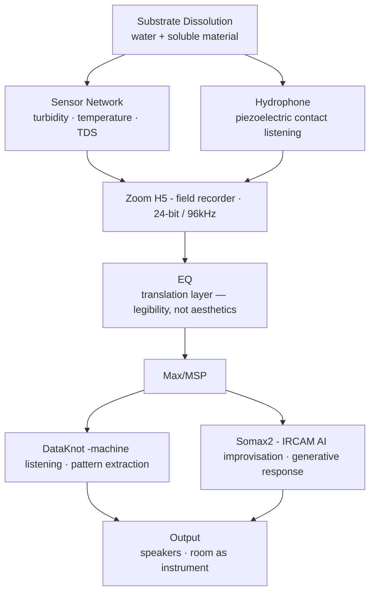

# Speculative Proposal — Example
**Project Title:** Did Sun Ra Fear Cryosleep?
**Researcher:** Darren Woodland, Jr.
**Course:** DIGM 553/753

---

## (a) Driving Curiosity → “What Is Your Dog?”

My entry point is dissolution. A commitment to the entanglement of materiality and time. Specifically, the acoustic behavior of materials as they break down in water; and what it might mean to listen to that process as composition. A metaphor for the bodies, souls, and memories of those lost in Atlantic Slave Trade. Dissolved and deposited by the salt of the ocean. The question I keep returning to is not *what does this sound like* but *what does this process already know*? Substrate dissolution is a form of material memory. The hydrophone doesn't record it so much as it makes it legible through is very specific observational form.

The title of this work, *Did Sun Ra Fear Cryosleep?*, holds the tension I am working in: between preservation and release, between a body suspended in wait and a body that has already gone. Sun Ra's cosmological thinking was often about escape. Escape from category, from Earth, from the conditions that confined Black life in his time (and now). Cryosleep is a fantasy, or perhaps a fallacy, of control over that escape. A means to explore the tensions of modern western sci-fi depictions of “colonial/colony ships” and the bodies suspended in transport aboard them; traversing space-time to “escape.” In a way dissolution being listened to is a refusal of control. It goes on its own terms and is the generative material for processes with just as much lack of control.

***This is my dog: the specific, non-transferable relation between listening, material change, and what Black cosmological thought does to the idea of escape, preservation, and control.***

---

## (b) Matter-Network — Signal Chain

**Materials:** water, soluble substrate — salt, chalk, sugar each dissolve differently — turbidity/temperature/TDS sensors, hydrophone, Zoom H5, laptop, speaker array.

**Environment:** The dissolution happens in a contained vessel. The sensors report its state; the hydrophone listens from inside it. The speakers extend the process into the room. The listener hears a composed version of something that is also actually happening in real-time.

---

## (c) Enabling Constraints

Three constraints that shape the work without predetermining it:

**1. The sensor network monitors, not interprets.** (Material Constraint) Turbidity, temperature, and TDS sensors track the dissolution state of the substrate continuously. The hydrophone — itself piezoelectric, meaning it listens through contact with the medium — captures the acoustic behavior of that same process. The constraint is that no single sensor speaks for the whole.

**2. Minimal but honest processing of the raw capture.** (Technical Constraint) The Zoom H5 transmits (not records) what the hydrophone picks up. That signal passes through EQ before entering Max/MSP in an attempt to make it legible to DataKnot and Somax2. The EQ is a translation layer. The constraint is that processing stops where interpretation begins.

**3. The AI listens before I do.** (Affective Constraint) Somax2 ingests the live hydrophone signal and generates its response before anyone hears a playback mix. My role is to curate the output, not author it. This keeps the agency distributed across material, algorithm, and body.

---

## (d) Epistemic Positioning Statement

Max/MSP is not a neutral tool. It encodes a particular logic of signal flow. A logic of discrete objects, patch cables, top-to-bottom data movement. This logic comes out of mid-century electronic music and telecommunications research. It assumes modularity. It assumes you can isolate a process, route it, transform it, and route it again without the transformation changing the thing, fundamentally, without intent.

I am working with and against that assumption. The dissolution I am listening to is not modular. It does not isolate cleanly. Somax2 adds another layer: it is trained on corpora, it has priors, it responds to pattern. It is not listening the way I listen or the way the water listens. That difference is generative. I am not trying to make the system simulate the material, what I am trying to  do is make those incommensurable modes of listening produce something together that none of them could produce alone.

The broader epistemic question the work is asking: *what does it mean to let a material process be a composer?* And what does it mean to build a system that is honest about the fact that it cannot fully hear what it is working with, unlike a composer?

---

## (e) The Boundary Object

The department needs to see a project that demonstrates technical rigor and conceptual coherence; a clear connection between the readings and the making decisions, and evidence that I understand what an enabling constraint actually does. The course context also needs something that can be assessed: a legible document, a traceable methodology, an artifact that can be presented and discussed.

What my practice needs is different. _Did Sun Ra Fear Cryosleep?_ is not primarily a demonstration of technical competence. It is an attempt to listen to a material process that has already decided what it is going to do, and to build a system honest enough to admit it cannot fully hear or control that. The work is successful, from inside my practice, if it stays uncomfortable and uncontrollable.

The gap: the course needs completion and legibility. My practice needs the work to remain open and a little unresolved. These are not irreconcilable, but they pull in different directions. The proposal format itself is a boundary object, it asks me to be precise about something that is still becoming. I am writing it knowing that the project will outgrow whatever I say here, and that is fine too.

---

> [!note] *This is a living document. The proposal will be revised in Week 10 to reflect what the project has become.*
