# Critical Thinking and Creative Problem Solving for Artists, Designers, and Technologists

## Introduction

In creative and technical work, the ability to solve problems systematically often matters more than any specific tool knowledge. Whether you're debugging a shader, designing a character, or optimizing game performance, the same core thinking skills apply.

This guide teaches you to approach challenges methodically rather than hoping for inspiration or getting paralyzed by complexity. You'll learn to break down problems, research effectively, and iterate toward solutions.

> [!info] How This Connects: 
> This guide pairs with the [[GMAP 395 - Guide - Procedural Modeling Fundamentals]] - the problem-solving framework here applies directly to technical modeling challenges, while working through geometry problems reinforces these thinking patterns.

##
---

## Chapter 1: Problem Decomposition

### 1.1 Breaking Down Complex Challenges

🎯 **Problem/Goal:** You're tasked with creating an entire game environment but feel overwhelmed by the scope.

> [!tip] Quick Reality Check, Ask yourself: "If I had to demo this in 2 weeks, what's the absolute minimum that needs to work?"

#### 💡 Key Concepts

|Concept|What It Means|Why It Matters|
|---|---|---|
|**Core vs. Nice-to-Have**|Must-do vs. would-be-cool|Prevents scope creep|
|**Natural Break Points**|Logical system divisions|Makes progress measurable|
|**Dependency Mapping**|What needs what, when|Prevents bottlenecks|

#### 🛠️ One Example Path: Medieval Castle Breakdown

```mermaid
%%{init: {'theme':'dark'}}%%
graph TD
    A[Medieval Castle] --> B[🔴 Core Requirements]
    A --> C[🟡 Natural Systems] 
    A --> D[🟢 Dependencies]
    
    B --> B1[Playable Space]
    B --> B2[Art Style Fit]
    B --> B3[Performance Budget]
    
    C --> C1[Structural: Walls, Towera]
    C --> C2[Functional: Gates, Bridges]
    C --> C3[Atmospheric: Props, FX]
    
    D --> D1[Layout → Modeling]
    D --> D2[Structure → Details]
    D --> D3[Hero → Background]
```



> [!example] Breaking It Down Step-by-Step 
> **Instead of:** "I need to make a castle, fast" _(panic mode)_
> 
> **Try this:**
> 
> 1. 🔴 **Core:** Outer walls + main gate + courtyard
> 2. 🟡 **Systems:** Towers (3), inner buildings (2), details
> 3. 🟢 **Order:** Blockout → structures → props → polish

> [!warning] Common Pitfall Don't start with the most exciting part - start with what everything else depends on.

#### 🔄 Variation Prompts

|Environment Type|Key Changes|Special Considerations|
|---|---|---|
|**Sci-Fi**|Tech integration, material systems|Power/data flow logic|
|**Interior**|Lighting, scale, detail density|Player navigation flow|
|**Team Project**|Handoff points, communication|Version control, standards|

#### ⚡ Alternative Approaches

```markdown
🔽 **Top-Down**
Layout → Major structures → Details → Polish

🔼 **Bottom-Up** 
Modular pieces → Combinations → Full system

👥 **Collaborative**
Team brainstorm → Divide responsibilities → Regular check-ins
```

> [!info] Learn More
> 
> - [Environment Design Fundamentals](https://www.artstation.com/learning/courses/aJ/environment-design-fundamentals)
> - [Game Production Pipelines](https://www.gamedeveloper.com/production/)
> - [Scoping for Indie Games](https://www.youtube.com/watch?v=dHMNeNapL1E)

#### 🎯 Transfer Challenge

**Apply this to shader creation:** Break down realistic water material:

- 🔴 **Core:** Base color + basic normal
- 🟡 **Systems:** Waves + foam + reflection + refraction
- 🟢 **Dependencies:** Surface → animation → interaction effects

> [!success] Success Metric You've mastered this when you can take any overwhelming task and create a clear, ordered breakdown in under 30 minutes.

###
---
### 1.2 Identifying Constraints and Resources

🎯 **Problem/Goal:** Understanding what you're really working with and against so you can plan realistically.

> [!quote] Design Wisdom "Constraints are not limitations - they're the foundation that makes creativity possible."

#### 💡 Key Concepts

|Constraint Type|Examples|Impact on Strategy|
|---|---|---|
|**Technical**|Poly budgets, texture memory, platform limits|Choose appropriate detail levels|
|**Time/Scope**|Deadlines, work hours, team size|Prioritize ruthlessly|
|**Tools/Knowledge**|Available software, team skills|Plan learning curve|
|**Creative**|Art style, brand guidelines, genre|Turn limits into distinctive features|

#### 🛠️ One Example Path: Mobile Game Character Planning


> [!example] Constraint-Driven Design **Given:** Mobile character with strict limits
> 
> **Constraints become features:**
> 
> - Low poly → Stylized, iconic look
> - Single texture → Cohesive color palette
> - No transparency → Bold, graphic design
> - Small screen → Strong silhouette focus

#### 🔄 Variation Prompts

|Platform|Primary Constraints|Design Adaptations|
|---|---|---|
|**VR**|Stereoscopic rendering, motion comfort|Larger UI elements, stable references|
|**Console**|Fixed hardware specs|Optimize for specific targets|
|**PC**|Variable hardware|Scalable quality settings|

#### ⚡ Alternative Approaches

- 🎯 **Constraint Prioritization:** Rank which limits are hardest vs. most flexible
- 💡 **Creative Reframing:** Ask "What becomes possible because of this limitation?"
- 📊 **Resource Auditing:** List available tools, time, and skills

> [!tip] Pro Technique Document your constraints visually - create a "constraint poster" for your workspace as a constant reminder.

#### 🎯 Transfer Challenge

Apply constraint analysis to a UI design:

- Technical: Screen sizes, input methods, performance
- Usability: Accessibility, user experience, platform conventions
- Aesthetic: Brand guidelines, art direction, readability

> [!success] Success Metric You can quickly identify the 3 most limiting constraints for any project and explain how they'll shape your approach.

##
---

## Chapter 2: Research and Reference Strategies

### 2.1 Effective Reference Gathering

🎯 **Problem/Goal:** You need to create something you've never made before and don't know where to start.

#### 💡 Key Concepts

|Reference Type|Purpose|Sources|
|---|---|---|
|**Visual**|How things look, why they look that way|Films, games, art, photography|
|**Technical**|How effects are achieved|Tutorials, breakdowns, documentation|
|**Conceptual**|Ideas from related fields|Architecture, nature, other industries|
|**Library Building**|Organized resources for future use|Personal collection, team databases|

#### 🛠️ One Example Path: Stylized Water Shader Research


> [!example] Research Strategy in Action **Goal:** Cartoon-style water shader
> 
> **Research layers:**
> 
> 1. 🎨 **Visual:** How does stylized water "read" as water?
> 2. 🔧 **Technical:** What real-time techniques exist?
> 3. 💭 **Conceptual:** How do animators suggest water movement?

> [!tip] Reference Organization
> 
> - Create folders by project and concept
> - Tag images with keywords and techniques
> - Note why each reference is useful
> - Share collections with team members

#### 🔄 Variation Prompts

|Creation Type|Research Focus|Special Considerations|
|---|---|---|
|**Fictional Elements**|Concept art, similar media|Establish internal logic|
|**Historical Accuracy**|Primary sources, expert analysis|Cultural sensitivity|
|**Interactive Elements**|UX patterns, usability studies|Player behavior research|

#### ⚡ Alternative Approaches

- 🖼️ **Mood Boards:** Feeling and atmosphere over technical specifics
- 🔧 **Technical Breakdowns:** Focus on construction methods
- 👥 **Collaborative Research:** Team members research different aspects

> [!info] Essential Resources
> 
> - [ArtStation Learning](https://www.artstation.com/learning)
> - [80 Level Breakdowns](https://80.lv/)
> - [Real-Time Rendering Resources](http://www.realtimerendering.com/)

#### 🎯 Transfer Challenge

Research for character design across game genres:

- Visual: Art styles, proportions, appeal factors
- Technical: Rigging constraints, animation needs, performance
- Conceptual: Psychology of character design, cultural considerations

> [!success] Success Metric You can efficiently gather diverse, relevant references and explain how each one informs your creative decisions.

###
---
### 2.2 Adapting Solutions from Different Contexts

🎯 **Problem/Goal:** The exact solution doesn't exist, but similar problems have been solved elsewhere.

#### 💡 Key Concepts

|Adaptation Skill|What It Means|Why It's Powerful|
|---|---|---|
|**Principle Extraction**|Finding core ideas vs. specific execution|Ideas transfer between contexts|
|**Cross-Domain Transfer**|Solutions from one field to another|Expands your solution space|
|**Pattern Recognition**|Seeing similar challenges everywhere|Builds problem-solving library|

#### 🛠️ One Example Path: Film VFX → Real-Time Game Effects


> [!example] Translation Process **Film technique:** Complex particle systems **Core principle:** Layered depth creates visual richness **Game adaptation:** Animated texture layers with depth sorting

> [!warning] Common Mistake Don't just copy techniques - understand why they work first.

#### 🔄 Variation Prompts

|Source Domain|Target Domain|Key Considerations|
|---|---|---|
|**Traditional Art**|Digital Creation|Maintain artistic principles|
|**Architecture**|Game Environments|Structural logic and flow|
|**Engineering**|Technical Art|Problem-solving approaches|

#### ⚡ Alternative Approaches

- 🎯 **Direct Adaptation:** Recreate exactly, then optimize
- 💡 **Principle Extraction:** Understand the why, rebuild the how
- 🔄 **Hybrid Methods:** Combine multiple source approaches

> [!tip] Cross-Pollination Technique Regularly browse fields outside your specialty - architecture, fashion, industrial design, biology.

#### 🎯 Transfer Challenge

Adapt web design patterns to game UI:

- Hover effects → Controller/touch feedback
- Navigation patterns → Game menu systems
- Responsive design → Multiple screen sizes

> [!success] Success Metric You can see solutions in unexpected places and successfully adapt them to your creative challenges.

###
---
### 2.3 Evaluating and Validating Information

🎯 **Problem/Goal:** Not all tutorials and advice are good - how do you know what to trust?

#### 💡 Key Concepts

|Evaluation Factor|Questions to Ask|Red Flags|
|---|---|---|
|**Source Credibility**|Who created this? What's their experience?|No attribution, questionable expertise|
|**Context Relevance**|When was this made? What platform/tools?|Outdated info, different context|
|**Testing Validation**|Does this work in my situation?|No testing, unrealistic claims|

#### 🛠️ One Example Path: Evaluating Mobile Optimization Advice

> [!example] Conflicting Advice Scenario
>  **Source A:** "Never exceed 1,000 triangles" 
>  **Source B:** "Up to 5,000 triangles is fine"  
> **Source C:** "It depends on your target device"

**Evaluation process:**


> [!tip] Validation Strategy
> 
> 1. **Context Check:** When, where, why was this advice given?
> 2. **Small Test:** Build minimal example to verify claims
> 3. **Reasoning Analysis:** Understand the underlying logic

#### 🔄 Variation Prompts

|Advice Type|Validation Method|Special Considerations|
|---|---|---|
|**Artistic Guidance**|Portfolio analysis, peer review|Subjective vs. objective criteria|
|**Technical Claims**|Performance testing, documentation|Version dependencies, hardware differences|
|**Workflow Tips**|Personal experimentation|Team vs. solo context|

#### ⚡ Alternative Approaches

- 👥 **Community Validation:** Ask experienced practitioners
- 🧪 **Personal Testing:** Build experiments to verify claims
- 📚 **Contextual Research:** Find advice specific to your situation

> [!warning] Information Quality Red Flags
> 
> - No source attribution or credentials
> - Claims without supporting evidence
> - Advice that seems too good to be true
> - Information that contradicts established best practices

#### 🎯 Transfer Challenge

Evaluate design principles for different audiences:

- **Research:** What evidence supports these principles?
- **Test:** How do different user groups respond?
- **Context:** When do these principles apply vs. not apply?

> [!success] Success Metric You can quickly assess information credibility and know when to dig deeper vs. accept advice.

##
---

## Chapter 3: Iterative Problem-Solving Approaches

### 3.1 Prototyping and Testing Strategies

🎯 **Problem/Goal:** You need to test ideas quickly without investing too much time in any single approach.

#### 💡 Key Concepts

|Prototyping Principle|Purpose|Benefits|
|---|---|---|
|**Minimum Viable Tests**|Smallest experiment that gives useful info|Fast feedback, low investment|
|**Rapid Iteration**|Quick test-learn-adjust cycles|Fail fast, learn faster|
|**Failure as Information**|Treating failures as data points|Reduces fear, increases learning|

#### 🛠️ One Example Path: Platformer Character Movement


> [!example] Prototype Progression **Week 1:** Gray boxes, test jump feel **Week 2:** Basic character shape, test animations  
> **Week 3:** Add visual feedback, test player reactions **Week 4:** Final art pass on proven mechanics

> [!tip] Prototyping Hierarchy
> 
> 1. **Core functionality** (does it work?)
> 2. **User experience** (does it feel right?)
> 3. **Visual polish** (does it look good?)

#### 🔄 Variation Prompts

|Element Type|Prototype Focus|Testing Method|
|---|---|---|
|**Visual Effects**|Timing and impact|A/B comparison videos|
|**UI Systems**|Usability and flow|User testing sessions|
|**Audio Design**|Emotional response|Blind listening tests|

#### ⚡ Alternative Approaches

- 📄 **Paper Prototypes:** Test concepts without digital tools
- 🖼️ **Digital Mockups:** Non-functional visual representations
- 🔧 **Hybrid Methods:** Combine low-fi and high-fi strategically

> [!warning] Prototype Pitfalls
> 
> - Making prototypes too polished (wastes time)
> - Testing only one variable at a time (misses interactions)
> - Skipping documentation (loses valuable insights)

#### 🎯 Transfer Challenge

Prototype a new art style:

- **Visual test:** Single character/prop in new style
- **Consistency test:** Multiple assets using same approach
- **Context test:** Assets in actual game environment

> [!success] Success Metric You can rapidly test core assumptions and pivot based on prototype feedback without emotional attachment to early work.

###
---
### 3.2 Documentation and Reflection Practices

🎯 **Problem/Goal:** Learning from your process so you can improve and repeat successes.

#### 💡 Key Concepts

|Documentation Type|Focus|Value|
|---|---|---|
|**Process Records**|How you solved problems|Reusable methods|
|**Decision Tracking**|Why you chose approaches|Learn from choices|
|**Knowledge Building**|Resources and techniques|Personal reference library|

#### 🛠️ One Example Path: Complex Shader Documentation


> [!example] Documentation Template **Project:** Stylized Water Shader **Goal:** Cartoon ocean for mobile game **Research:** 3 days studying animated films **Attempts:** Tried particle system (too heavy), vertex animation (wrong look) **Breakthrough:** Combined UV scrolling with vertex displacement **Result:** 60fps on target device, matches art style **Next time:** Start with performance constraints, not visual goals

> [!tip] Documentation Timing
> 
> - **During work:** Quick notes, screenshots of progress
> - **After sessions:** Reflection on what worked/didn't
> - **Project end:** Complete analysis and lessons learned

#### 🔄 Variation Prompts

|Project Type|Documentation Focus|Special Considerations|
|---|---|---|
|**Collaborative Work**|Decision rationale, handoff notes|Multiple perspectives|
|**Time-Critical Projects**|Essential decisions only|Lightweight documentation|
|**Experimental Work**|Failed attempts, learning insights|High value in "failures"|

#### ⚡ Alternative Approaches

- 📝 **Written Logs:** Traditional journaling and note-taking
- 📸 **Visual Documentation:** Screenshots, progress videos, annotated images
- 🎥 **Process Recording:** Screen capture while working

> [!info] Documentation Tools
> 
> - **Text:** Notion, Obsidian, simple markdown files
> - **Visual:** Milanote, PureRef, Pinterest boards
> - **Mixed:** Personal wiki, team knowledge base

#### 🎯 Transfer Challenge

Document a challenging modeling or animation process:

- **Process:** What steps did you follow?
- **Problems:** Where did you get stuck and how did you solve it?
- **Patterns:** What problem-solving approaches emerged?

> [!success] Success Metric You have a growing personal knowledge base that you actively reference and update, making each project easier than the last.

##
---

## Chapter 4: Collaboration and Communication

### 4.1 Communicating Problems and Solutions

🎯 **Problem/Goal:** Getting help when stuck and explaining your work to others effectively.

#### 💡 Key Concepts

|Communication Skill|Purpose|Impact|
|---|---|---|
|**Problem Articulation**|Describe issues clearly|Get better help faster|
|**Visual Communication**|Show rather than tell|Reduce misunderstandings|
|**Strategic Questioning**|Ask for specific help|Get actionable responses|

#### 🛠️ One Example Path: Getting Help with Technical Issues

> [!example] Poor vs. Good Help Requests
> 
> **❌ Poor request:** "My shader is broken, help!"
> 
> **✅ Good request:** "I'm creating a stylized water shader for mobile. It should look cartoon-like but I'm getting realistic results. Here's what I have [screenshot], here's what I want [reference image], and here's what I've tried [node graph]. Working in Blender 3.6, targeting Android devices. Any suggestions for the cartoon look?"


#### 🔄 Variation Prompts

|Audience Type|Communication Adjustments|Key Considerations|
|---|---|---|
|**Technical Peers**|Detailed specs, code examples|Assume technical knowledge|
|**Creative Directors**|Visual comparisons, style impact|Focus on creative vision|
|**Producers/Clients**|Timeline impact, resource needs|Business implications|

#### ⚡ Alternative Approaches

- 💬 **Synchronous:** Real-time conversation, screen sharing
- 📧 **Asynchronous:** Detailed written explanations with materials
- 🎥 **Video:** Record problem demonstration with narration

> [!tip] Help Request Template
> 
> 1. **Goal:** What are you trying to achieve?
> 2. **Current State:** What's happening now?
> 3. **Context:** Tools, platform, constraints
> 4. **Attempts:** What have you already tried?
> 5. **Specific Ask:** What kind of help do you need?

#### 🎯 Transfer Challenge

Explain a complex technical process to a non-technical team member:

- Use analogies and visual aids
- Focus on outcomes rather than methods
- Check understanding throughout explanation

> [!success] Success Metric You consistently get helpful responses to your questions and can explain your work clearly to different audiences.

###
---
### 4.2 Learning from Others' Problem-Solving

🎯 **Problem/Goal:** Accelerating your growth by understanding how others think through challenges.

#### 💡 Key Concepts

|Learning Method|Focus|Benefits|
|---|---|---|
|**Process Observation**|How experts work|Learn thinking patterns|
|**Solution Reverse-Engineering**|How existing work was made|Build technical knowledge|
|**Community Participation**|Collective problem-solving|Access to diverse perspectives|

#### 🛠️ One Example Path: Learning from Senior Artist Breakdowns


> [!example] What to Look For 
> **Surface level:** What tools they use, what settings they choose 
> **Deeper level:** When they pause to evaluate, how they handle mistakes, what order they work in 
> **Deepest level:** How they think about problems, what principles guide their decisions

> [!tip] Active Learning Approach
> 
> - **Watch once** for overall impression
> - **Watch again** taking notes on decision points
> - **Try to replicate** the approach on your own project
> - **Adapt** the method to your specific needs

#### 🔄 Variation Prompts

|Learning Source|Unique Value|How to Extract It|
|---|---|---|
|**Different Disciplines**|Fresh perspectives|Look for transferable principles|
|**Online Communities**|Diverse approaches|Participate in discussions|
|**Formal Mentorship**|Personalized guidance|Ask about thinking process|

#### ⚡ Alternative Approaches

- 🎓 **Structured Learning:** Courses, workshops, formal training
- 💬 **Community Learning:** Forums, Discord servers, study groups
- 🔍 **Self-Directed Study:** Analyzing published work and breakdowns

> [!info] Learning Communities
> 
> - [Polycount](https://polycount.com/) - Technical art community
> - [Real-Time VFX](https://realtimevfx.com/) - Effects artists
> - [Tech Art Aid](https://tech-art-aid.com/) - Technical art resources

#### 🎯 Transfer Challenge

Analyze a workflow from a different creative field:

- **Architecture:** How do architects plan complex projects?
- **Film:** How do VFX artists approach problem-solving?
- **Product Design:** How do industrial designers iterate?

Adapt one insight to your game development work.

> [!success] Success Metric You can identify valuable learning opportunities in unexpected places and successfully integrate new approaches into your workflow.

##
---

## Conclusion: Building Your Problem-Solving Toolkit

The techniques in this guide become more powerful with practice. Start applying them to small challenges before tackling major projects. Each problem you solve systematically builds your confidence and expands your toolkit.

> [!summary] Key Takeaways
> 
> - **Break down** complex challenges into manageable pieces
> - **Research broadly** and adapt solutions creatively
> - **Iterate quickly** and learn from failures
> - **Document your process** for future reference
> - **Collaborate effectively** to amplify your capabilities

> [!note] Next Steps
> 
> 1. Practice these techniques on your current projects
> 2. Build your personal reference and knowledge libraries
> 3. Find communities where you can both seek and offer help
> 4. Continue learning by analyzing others' problem-solving approaches

Remember: The goal isn't to never get stuck, but to have systematic ways of getting unstuck. Every challenge becomes an opportunity to strengthen your problem-solving skills.

##
---
---