# Procedural Modeling with Modular Thinking - A Beginner's Guide

## Introduction

Procedural modeling means creating geometry through systematic, repeatable processes rather than manually placing every vertex. This approach excels in game development where you need efficient workflows, consistent results, and the ability to iterate quickly.

This guide teaches modular thinking - breaking complex forms into simple, reusable components that combine into sophisticated systems. While examples use Blender's Geometry Nodes, these principles apply to any procedural modeling tool.

> [!info] How This Connects:
> This guide pairs with the [[Critical Thinking and Creative Problem Solving Guide]] - the systematic problem-solving approaches there apply directly to procedural modeling challenges, while working through geometry problems reinforces those thinking patterns.

##
---

## Chapter 1: Fundamental Concepts and Mindset

### 1.1 Understanding Procedural vs. Manual Modeling

🎯 **Problem/Goal:** When should you choose procedural approaches over traditional modeling?

> [!question] Key Decision Point Ask yourself: "Will I need multiple variations of this, or will it change frequently during development?"

#### 💡 Key Concepts

|Concept|Manual Modeling|Procedural Modeling|
|---|---|---|
|**Workflow**|Direct vertex manipulation|Parameter-driven generation|
|**Changes**|Requires remodeling|Adjust parameters instantly|
|**Variations**|Copy and manually modify|Generate infinite variations|
|**Iteration**|Time-consuming|Real-time feedback|

#### 🛠️ One Example Path: Simple Building Comparison

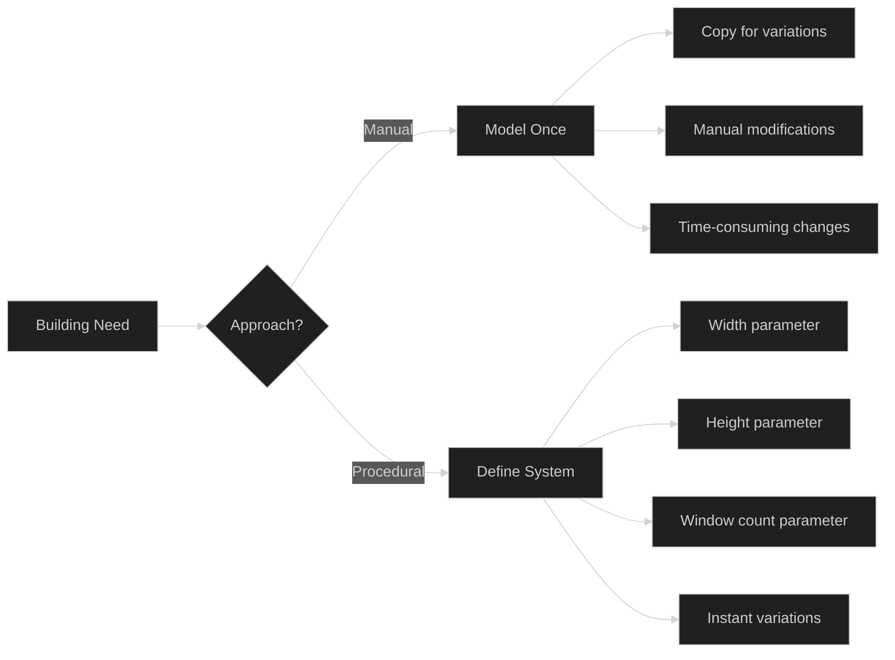

> [!example] Building System Breakdown 
> **Manual approach:**
> 
> - Model walls, roof, windows individually _(3 days)_
> - Copy and modify for 5 variations _(2 more days)_
> - Client wants changes _(start over: 2+ days)_
> 
> **Procedural approach:**
> 
> - Define parameter system _(4 days)_
> - Generate 50 variations _(instant)_
> - Client changes _(adjust parameters: hours)_

> [!tip] When to Choose Procedural ✅ Need multiple variations ✅ Expect frequent changes  
> ✅ Repetitive patterns involved ✅ Performance optimization needed
> 
> ❌ One-off hero assets ❌ Highly organic, unique forms ❌ Tight deadline with simple needs

#### 🔄 Variation Prompts

|Asset Type|Procedural Value|Considerations|
|---|---|---|
|**Organic Shapes**|Trees, rocks, terrain|Natural variation patterns|
|**Characters**|Customization, crowd systems|Rigging complexity|
|**Environments**|Modular construction|Art direction consistency|

#### ⚡ Alternative Approaches

- 🔧 **Full Procedural:** Everything generated from parameters
- 🎨 **Template-Based:** Manual base with procedural variations
- 🔄 **Hybrid Workflow:** Manual hero pieces, procedural background

> [!info] Essential Tools
> 
> - [Blender Geometry Nodes](https://docs.blender.org/manual/en/latest/modeling/geometry_nodes/index.html)
> - [Houdini](https://www.sidefx.com/learn/)
> - [Maya MASH](https://knowledge.autodesk.com/support/maya/learn-explore/caas/CloudHelp/cloudhelp/2018/ENU/Maya-CharacterAnimation/files/GUID-3CB2B4B3-9F8E-4E99-8210-CC4AE5CDA31C-htm.html)

#### 🎯 Transfer Challenge

Identify procedural opportunities in your current project:

- What gets repeated with variations?
- What might change during development?
- Where do you spend time on repetitive tasks?

> [!success] Success Metric You can quickly evaluate whether a modeling task would benefit from procedural approaches and explain the trade-offs.

###
---
### 1.2 Modular Thinking Principles

🎯 **Problem/Goal:** Building complex systems from simple, reusable components.

#### 💡 Key Concepts

|Principle|Meaning|Benefit|
|---|---|---|
|**Component-Based**|Small pieces that combine predictably|Reusability and flexibility|
|**Clear I/O**|Defined inputs and outputs|Predictable connections|
|**Hierarchical**|Simple components build complex ones|Manageable complexity|
|**Abstraction Levels**|Different detail levels for different needs|Scalable systems|

#### 🛠️ One Example Path: Medieval Village System

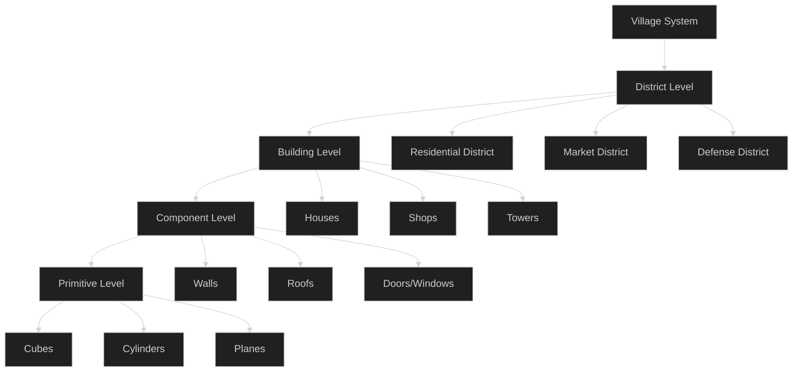

> [!example] System Implementation **Geometry Nodes hierarchy:**
> 
> 1. **Wall Component:** `length`, `height` → wall geometry
> 2. **Building Component:** uses walls, adds `roof_type`, `door_count`
> 3. **District Component:** arranges buildings with `spacing`, `variety`
> 4. **Village Component:** combines districts with roads and features

> [!tip] Modular Design Principles
> 
> - **Single Responsibility:** Each component does one thing well
> - **Composability:** Components combine in predictable ways
> - **Parameterization:** Expose the right level of control
> - **Documentation:** Clear naming and organization

#### 🔄 Variation Prompts

|Context|Modular Considerations|Special Challenges|
|---|---|---|
|**Team Projects**|Shared component libraries|Version control, standards|
|**Performance Critical**|LOD systems, optimization|Baking vs. runtime decisions|
|**Art Direction**|Style consistency|Balancing variety with coherence|

#### ⚡ Alternative Approaches

- 🏗️ **Hierarchical Systems:** Clear levels of complexity
- 🕸️ **Network Systems:** Flexible component connections
- 📋 **Template Systems:** Pre-built arrangements with variation

> [!warning] Modular Pitfalls
> 
> - Over-engineering simple tasks
> - Creating too many parameters (analysis paralysis)
> - Losing artistic control to systems
> - Ignoring performance implications

#### 🎯 Transfer Challenge

Apply modular thinking to non-geometry systems:

- **UI System:** Buttons → Panels → Screens → Full Interface
- **Animation Rig:** Controls → Sub-systems → Character → Scene
- **Material Library:** Textures → Shaders → Material Sets → Environment

> [!success] Success Metric You naturally think in terms of reusable components and can design systems that others can understand and extend.

##
---

## Chapter 2: Core Geometric Operations

### 2.1 Primitive Generation and Transformation

🎯 **Problem/Goal:** Understanding the building blocks of all geometry.

#### 💡 Key Concepts

|Primitive Type|Common Uses|Key Properties|
|---|---|---|
|**Cube**|Buildings, containers, base shapes|6 faces, regular proportions|
|**Cylinder**|Columns, pipes, organic bases|Radial symmetry, caps|
|**Sphere**|Organic forms, detail elements|Uniform surface, subdivision|
|**Plane**|Terrain, flat surfaces, UI elements|2D base for extrusion|

#### 🛠️ One Example Path: Modular Wall System

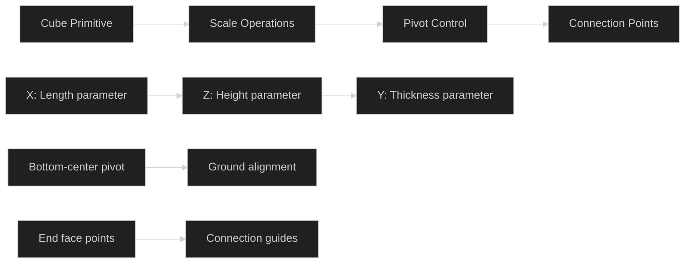

> [!example] Wall Component Setup **In Geometry Nodes:**
> 
> 1. **Cube Primitive** → base shape
> 2. **Transform:** Scale X (length), Z (height), Y (thickness)
> 3. **Set Origin:** Bottom center for ground placement (set position offset)
> 4. **Distribute Points on Faces:** End faces for connections
> 5. **Instance Cubes:** Small connection indicators

> [!NOTE] Concept Demo Video 📹
    > https://1drv.ms/v/c/b08de2251f1b33a4/IQQS-O5nJ7T8SZRUW73GeOklAYqB9oAfScfkZE1FsemvPTI?width=660

> [!tip] Transform Best Practices
> 
> - **Consistent Origins:** Decide on pivot standards for your project
> - **Parameter Ranges:** Set min/max values that make sense
> - **Local vs. World:** Understand coordinate system implications
> - **Non-Destructive:** Keep original proportions accessible

#### 🔄 Variation Prompts

|Scenario|Considerations|Solutions|
|---|---|---|
|**Custom Primitives**|Project-specific base shapes|Mathematical generation or pre-modeled bases|
|**Art Style Needs**|Stylized vs. realistic proportions|Different primitive libraries|
|**Performance Targets**|Polygon count optimization|LOD primitive variations|

#### ⚡ Alternative Approaches

- 📐 **Mathematical Generation:** Create primitives from formulas
- 📍 **Point-Based Construction:** Build from vertex positions
- 🎨 **Profile-Based:** Extrude shapes from 2D curves

> [!info] Geometry Nodes Primitives
> 
> - `Cube` - Basic box primitive
> - `Cylinder` - Radial geometry
> - `Sphere` - Subdivided sphere (UV or Icosphere)
> - `Grid` - Plane with subdivisions

#### 🎯 Transfer Challenge

Create modular primitives for specific art styles:

- **Cyberpunk:** Angular, tech-heavy base shapes
- **Organic Forest:** Curved, natural-form primitives
- **Minimalist:** Clean, simple geometric bases

> [!success] Success Metric You can quickly generate appropriate base geometry and transform it systematically for different contexts.

###
---
### 2.2 Extrusion and Surface Operations

🎯 **Problem/Goal:** Growing 2D shapes into 3D forms and adding surface detail.

#### 💡 Key Concepts

|Operation|Purpose|Common Uses|
|---|---|---|
|**Extrude Faces**|Add depth and volume|Windows, architectural details|
|**Inset Faces**|Create borders and detail|Trim, panel lines, surface variation|
|**Bevel**|Round edges, add realism|Worn edges, mechanical parts|
|**Solidify**|Give thickness to surfaces|Converting planes to volumes|

#### 🛠️ One Example Path: Architectural Window Frame

> [!example] Window Frame Process **Geometry Nodes workflow:**
> 
> 1. **Select Faces:** Choose wall faces for windows
> 2. **Inset Faces:** Create window frame border (0.1m)
> 3. **Extrude Faces:** Push inward for depth (-0.05m)
> 4. **Inset Faces (inverse extrude):** Inner frame detail (0.02m)
> 5. **Delete Geometry:** Remove center faces for opening

> [!NOTE] Concept Demo Video 📹
    > https://1drv.ms/v/c/b08de2251f1b33a4/IQRNDviH63tESqeWgzLe91QMAW8n1piQFEuRij8IaR27GCE?width=660

> [!NOTE] A Note of Selections in GN
    > The selection capabilities are somewhat tool specific, it depends greatly on how that particular tool handles geometry data. In Blender GN, selection takes a bit more math or manual work. A hybrid approach of "preprocessing" you geometry and segmenting manually the pieces that need procedural elements is the better approach. With that said, below are some good sources on making selections in GN:
    > [Select What You Want in Geometry Nodes - Blender Tutorial](https://www.youtube.com/watch?v=p4rwhifXNCw)
    > [Where to Begin in Geometry Nodes: Selections](https://www.youtube.com/watch?v=BTFD1fnTVtk&t=303s)

> [!tip] Surface Detail Strategy
> 
> - **Primary forms first:** Establish main shapes before details
> - **Consistent depth:** Use similar inset/extrude values across project
> - **Normal direction:** Understand inside vs. outside faces
> - **Edge flow:** Maintain good topology for further operations

#### 🔄 Variation Prompts

|Detail Type|Extrusion Approach|Considerations|
|---|---|---|
|**Organic Surfaces**|Variable depth, curved profiles|Normal variation, smooth transitions|
|**Mechanical Parts**|Precise measurements, clean edges|Boolean compatibility, manufacturing logic|
|**Architectural**|Consistent proportions, structural logic|Building codes, realistic materials|

#### ⚡ Alternative Approaches

- 📏 **Linear Extrusion:** Straight path, constant profile
- 🎯 **Path Following:** Profile follows curve
- 🔄 **Adaptive Profile:** Shape changes along path

> [!warning] Extrusion Gotchas
> 
> - **Normal direction:** Pay attention to face orientation
> - **Topology complexity:** Too many operations create messy geometry
> - **Scale sensitivity:** Large scale differences can cause issues
> - **Boolean preparation:** Clean geometry for later operations

#### 🎯 Transfer Challenge

Apply extrusion thinking to character/vehicle design:

- **Armor pieces:** Layered protection with depth
- **Vehicle panels:** Surface detail and functional elements
- **Weapon design:** Grip details, decorative elements

> [!success] Success Metric You can efficiently add surface detail that enhances form while maintaining clean, workable topology.

###
---
### 2.3 Boolean Operations and Mesh Combination

🎯 **Problem/Goal:** Combining and cutting shapes to create complex forms.

#### 💡 Key Concepts

|Boolean Type|Operation|Use Cases|
|---|---|---|
|**Union**|A + B = Combined shape|Merging separate pieces|
|**Difference**|A - B = A with B removed|Cutting holes, subtracting volume|
|**Intersection**|A ∩ B = Only overlapping parts|Finding common areas|

#### 🛠️ One Example Path: Modular Wall with Cutouts

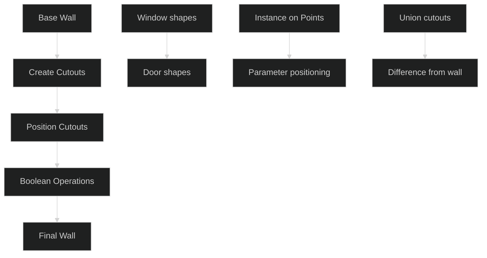

> [!example] Boolean Window System **Setup process:**
> 
> 1. **Base wall geometry** (from previous examples)
> 2. **Create cutout shapes** (rectangles for windows/doors)
> 3. **Position with parameters** (height, spacing, count)
> 4. **Instance on Points** to place multiple cutouts
> 5. **Realize Instances** to convert to geometry
> 6. **Boolean Union** to combine all cutouts
> 7. **Boolean Difference** final cutouts from wall

> [!NOTE] Concept Demo Video 📹
    > https://1drv.ms/v/c/b08de2251f1b33a4/IQROJ56L0_hcTrNC8rC65CDsAep7rrtHjh1FMHAGygNviaM?width=660

> [!tip] Boolean Best Practices
> 
> - **Clean input geometry:** No overlapping faces, good normals
> - **Appropriate resolution:** Match detail levels between objects
> - **Order of operations:** Union small pieces before main subtraction
> - **Fallback plans:** Have manual alternatives for complex cases

#### 🔄 Variation Prompts

|Application|Boolean Strategy|Special Challenges|
|---|---|---|
|**Curved Cuts**|Cylindrical/spherical cutters|Smooth transitions|
|**Complex Chains**|Multiple operation sequences|Order dependency|
|**Performance**|When to bake vs. keep procedural|Runtime cost vs. flexibility|

#### ⚡ Alternative Approaches

- 🔧 **Direct Boolean:** Use boolean operations throughout
- ✂️ **Manual Cutting:** Use traditional modeling tools
- 🎨 **Displacement:** Use textures to fake surface details

> [!warning] Boolean Limitations
> 
> - **Topology mess:** Can create n-gons and poor edge flow
> - **Performance cost:** Complex booleans are computationally expensive
> - **Precision issues:** Floating-point errors with very small/large objects
> - **Art direction:** May not give desired aesthetic control

> [!info] Boolean Alternatives When booleans don't work well:
> 
> - **Knife Project:** Cut along edges manually
> - **Displacement Maps:** Fake depth with textures
> - **Separate Objects:** Model pieces individually, assemble visually

#### 🎯 Transfer Challenge

Use boolean thinking for prop/mechanical design:

- **Complex machinery:** How would you break down a vehicle engine?
- **Architectural details:** Gothic cathedral with intricate stonework
- **Character armor:** Layered protection with functional details

> [!success] Success Metric You understand when booleans are appropriate and can predict potential problems before they occur.

##
---

## Chapter 3: Pattern Generation and Repetition

### 3.1 Array and Duplication Systems

🎯 **Problem/Goal:** Efficiently creating repeated elements with controlled variation.

#### 💡 Key Concepts

|Array Type|Pattern|Best For|
|---|---|---|
|**Linear**|Straight line repetition|Fences, columns, modular buildings|
|**Radial**|Circular/arc arrangement|Flower petals, gear teeth, stadium seating|
|**Grid**|2D rectangular pattern|Tiles, windows, crowd formations|
|**Path-Based**|Follow curve shapes|Roads, pipes, decorative molding|

#### 🛠️ One Example Path: Procedural Fence System

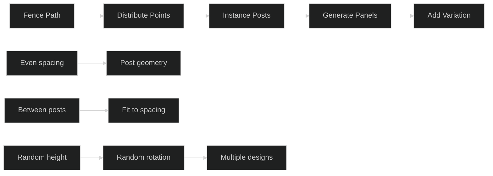

> [!example] Fence System Implementation **Geometry Nodes setup:**
> 
> 1. **Input:** Curve path for fence line
> 2. **Distribute Points on Curve:** Even spacing for posts
> 3. **Instance on Points:** Post geometry at each point
> 4. **Curve to Mesh:** Generate panels between posts
> 5. **Random Value:** Add height/rotation variation
> 6. **Switch:** Randomly select from multiple post designs

> [!NOTE] Concept Demo Video 📹
    > https://1drv.ms/v/c/b08de2251f1b33a4/IQSankMSvhEJS6TrDAp8X4c2AQfSKCbZwhD1IAEd9_U5xb4?width=660

> [!tip] Array Variation Techniques
> 
> - **Controlled randomness:** Use seed values for repeatable results
> - **Natural clustering:** Group similar elements with noise
> - **Progressive variation:** Gradual changes across array
> - **Rule-based selection:** Different elements based on conditions

#### 🔄 Variation Prompts

|Pattern Type|Variation Needs|Implementation Strategy|
|---|---|---|
|**Organic (Forest)**|Natural randomness|Noise-driven density and clustering|
|**Architectural**|Measured spacing, alignment|Grid-based with occasional breaks|
|**Character Crowds**|Individual differences, group behavior|Multiple source models with behavioral rules|

#### ⚡ Alternative Approaches

- 📐 **Simple Duplication:** Basic copy and offset
- 🎯 **Curve Following:** Elements follow complex paths
- 🌍 **Surface Scattering:** Distribution across 3D surfaces
- 📊 **Data-Driven:** Arrays controlled by external information

> [!warning] Array Performance Considerations
> 
> - **Instance vs. Copy:** Use instances when possible for memory efficiency
> - **LOD Systems:** Reduce detail for distant/background elements
> - **Culling:** Remove elements outside camera view
> - **Batching:** Group similar instances for rendering efficiency

#### 🎯 Transfer Challenge

Create arrays for different game contexts:

- **Foliage System:** Trees and plants with natural variation
- **Urban Details:** Street lights, signs, traffic elements
- **Crowd System:** Characters with different appearances and behaviors

> [!success] Success Metric You can create natural-looking patterns that feel random but are actually controllable and repeatable.

###
---
### 3.2 Instancing and Variation Systems

🎯 **Problem/Goal:** Managing memory and performance while creating visual variety.

#### 💡 Key Concepts

|Concept|Purpose|Implementation|
|---|---|---|
|**Instance Efficiency**|Memory optimization|One mesh, many positions|
|**Controlled Variation**|Natural-looking diversity|Parameter randomization|
|**Performance Balance**|Visual richness vs. speed|LOD and culling systems|
|**Library Management**|Organized reusable assets|Consistent naming and structure|

#### 🛠️ One Example Path: Procedural Rock Scattering

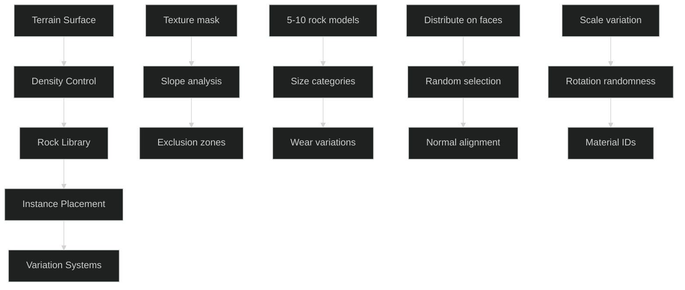

> [!example] Rock Scattering System **Advanced distribution:**
> 
> 1. **Terrain Analysis:** Use slope angle to control placement
> 2. **Density Texture:** Paint where rocks should/shouldn't appear
> 3. **Rock Library:** 8 different rock models in 3 size categories
> 4. **Smart Selection:** Larger rocks on steeper slopes
> 5. **Clustering:** Use noise to group rocks naturally
> 6. **Variation:** Random scale (80-120%), rotation, material wear

> [!NOTE] Concept Demo Video 📹
    > https://1drv.ms/v/c/b08de2251f1b33a4/IQSWpN9iwQ08RYuYhXc1rYm-AWrmTZDQS6i3EQIO-QcDtBs?width=660

> [!tip] Natural Variation Strategies
> 
> - **Size hierarchy:** Mix large, medium, small elements
> - **Clustering rules:** Group similar items, break uniformity
> - **Environmental logic:** Consider how things would naturally occur
> - **Layered randomness:** Multiple variation systems working together

#### 🔄 Variation Prompts

|Application|Variation Focus|Special Considerations|
|---|---|---|
|**Vehicle Traffic**|Car types, colors, damage|Gameplay vs. background detail|
|**Architectural Props**|Furniture, decorations, wear|Cultural consistency, period accuracy|
|**Crowd Systems**|Clothing, body types, animations|Performance vs. individuality|

#### ⚡ Alternative Approaches

- 🎲 **Pure Random:** Simple random selection
- 📊 **Weighted Selection:** Bias toward certain variations
- 🗺️ **Map-Driven:** Use textures to control placement
- 🎮 **Gameplay-Responsive:** Variation based on player actions

> [!info] Optimization Techniques **Distance-based LOD:**
> 
> - Near: Full detail instances
> - Medium: Simplified geometry
> - Far: Billboard sprites or removal
> 
> **Frustum Culling:**
> 
> - Remove instances outside camera view
> - Dynamic loading for streaming worlds

#### 🎯 Transfer Challenge

Design instancing for your game's specific needs:

- What repeated elements could benefit from variation?
- How would you balance memory vs. visual diversity?
- What environmental logic should guide placement?

> [!success] Success Metric You can create rich, varied environments that perform well and feel naturally distributed rather than obviously systematic.

##
---

## Chapter 4: Advanced Modular Techniques

### 4.1 Procedural UV and Texturing Considerations

🎯 **Problem/Goal:** Ensuring procedural geometry works well with texturing pipelines.

#### 💡 Key Concepts

|UV Strategy|Purpose|Trade-offs|
|---|---|---|
|**Automatic Generation**|Speed and consistency|Less artistic control|
|**Template-Based**|Predictable layouts|Limited to known shapes|
|**World-Space Projection**|Seamless tiling|Scale sensitivity|
|**Material ID Systems**|Different materials per part|Complexity management|

#### 🛠️ One Example Path: Modular Architecture UV System

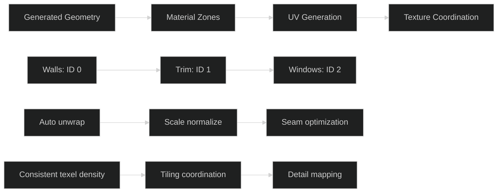

> [!example] UV Workflow for Procedural Buildings **Geometry Nodes setup:**
> 
> 1. **Material ID Assignment:**
>     - Walls get material index 0
>     - Trim/details get index 1
>     - Windows/doors get index 2
> 2. **UV Generation:**
>     - Auto unwrap with angle-based seams
>     - Normalize scale for consistent detail
>     - Apply world-space coordinates for seamless tiling
> 3. **Optimization:**
>     - Pack UVs efficiently
>     - Minimize stretching
>     - Align to texture grids

> [!NOTE] Concept Demo Video 📹
    > https://1drv.ms/v/c/b08de2251f1b33a4/IQSTFM-KBboMTKjea4FsBvyEAYgPwsMwLNDOjZIa1pI44vk?width=660

> [!NOTE] Procedural UV Tutorials for GN
    > [Blender Tutorial: Procedural UV Unwrapping with Geometry Nodes](https://www.youtube.com/watch?v=02XNGOVpSV4)
    > [How to create proper UV Maps with Geometry Nodes in Blender](https://www.youtube.com/watch?v=Ubeot7lIvTM)

> [!tip] UV Best Practices for Procedural Work
> 
> - **Consistent texel density:** Same detail level across all generated geometry
> - **Predictable seams:** Place seams where they won't be noticeable
> - **Tiling-friendly:** Consider how textures will repeat
> - **Material zones:** Group faces that need similar treatment

#### 🔄 Variation Prompts

|Asset Type|UV Challenges|Solutions|
|---|---|---|
|**Organic Shapes**|Complex surface curves|Projection-based mapping|
|**Mechanical Parts**|Precise alignment needs|Template-based layouts|
|**Terrain**|Large scale variation|Multiple texture layers|

#### ⚡ Alternative Approaches

- 🎯 **Manual UV Layout:** Traditional unwrapping workflow
- 🌍 **Triplanar Mapping:** No UVs needed, use world coordinates
- 📋 **Texture Atlasing:** Combine multiple textures into single atlas
- 📊 **Procedural Textures:** Generate patterns instead of using images

> [!warning] UV Pitfalls
> 
> - **Scale inconsistency:** Different texel density across objects
> - **Seam visibility:** Poor seam placement ruins illusion
> - **Stretching:** Distorted textures from bad UV ratios
> - **Waste:** Inefficient UV packing reduces texture resolution

> [!info] Geometry Nodes UV Tools
> 
> - `UV Unwrap` - Automatic unwrapping with various methods
> - `Set Position` - Manual UV coordinate control
> - `Store Named Attribute` - Save UV data for later use
> - `Sample Texture` - Read texture values in node graph

#### 🎯 Transfer Challenge

Plan UV strategy for a complex procedural system:

- **Vehicle Customization:** How would you handle paint jobs, decals, wear?
- **Character System:** Clothing, skin, accessories with different materials?
- **Environment Kit:** Modular pieces that tile seamlessly?

> [!success] Success Metric Your procedural geometry textures properly without visible seams or stretching, and maintains consistent quality across variations.

###
---
### 4.2 Performance and Optimization Thinking

🎯 **Problem/Goal:** Creating procedural systems that work within game engine constraints.

#### 💡 Key Concepts

|Performance Factor|Impact|Optimization Strategies|
|---|---|---|
|**Polygon Count**|Rendering speed|LOD systems, intelligent detail|
|**Draw Calls**|CPU performance|Instancing, batching|
|**Memory Usage**|System limitations|Texture sharing, geometry compression|
|**Generation Time**|Real-time vs. offline|Baking decisions, caching|

#### 🛠️ One Example Path: Mobile Building System Optimization

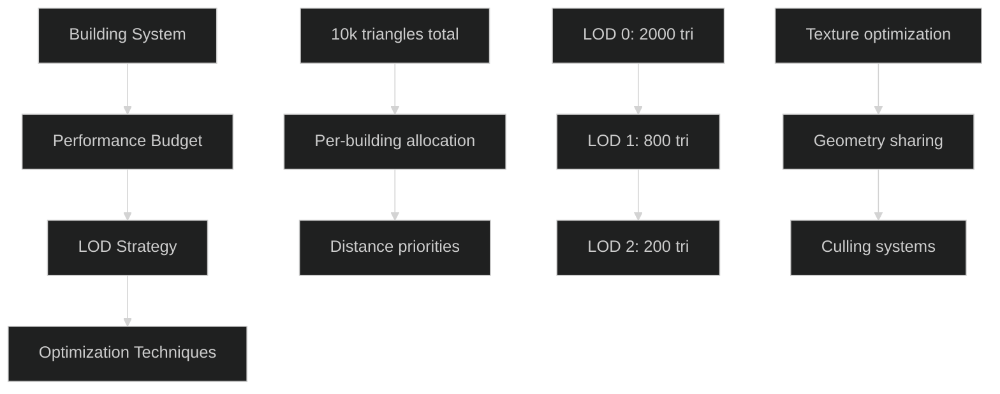

> [!example] Mobile Optimization Strategy **Performance targets:**
> 
> - Building cluster: 10,000 triangles maximum
> - Individual buildings: 500-2,000 triangles based on importance
> - 3 LOD levels per building type
> 
> **Optimization implementation:**
> 
> 1. **Distance-based LOD:** Far buildings become simple boxes
> 2. **Selective detail:** Hero buildings get full budgets
> 3. **Smart culling:** Remove back faces, occluded geometry
> 4. **Texture sharing:** Common materials across building types

> [!tip] Performance Planning
> 
> - **Budget first:** Define limits before building systems
> - **Measure early:** Profile on target hardware regularly
> - **Graceful degradation:** Systems should work at multiple quality levels
> - **User settings:** Expose quality options for different devices

#### 🔄 Variation Prompts

|Platform|Key Constraints|Optimization Focus|
|---|---|---|
|**VR**|90+ FPS requirement|Aggressive LOD, simplified shading|
|**Console**|Fixed hardware specs|Optimize for specific targets|
|**PC**|Variable performance|Scalable quality settings|
|**Mobile**|Battery/thermal limits|Conservative resource usage|

#### ⚡ Alternative Approaches

- 📐 **Geometric Optimization:** Reduce polygons while maintaining silhouette
- 🎨 **Texture Optimization:** Use detail textures instead of geometry
- ⚙️ **Shader Optimization:** Move complexity from geometry to materials
- 💾 **Streaming:** Load/unload content based on proximity

> [!warning] Optimization Traps
> 
> - **Premature optimization:** Don't optimize before measuring problems
> - **Over-optimization:** Sacrificing too much quality for minor gains
> - **Platform assumptions:** Different devices have different bottlenecks

- **Ignoring tools:** Engine-specific optimizations can be more effective

> [!info] Profiling Tools
> 
> - **Blender:** Statistics panel, vertex count displays
> - **Unity:** Profiler, Frame Debugger, Graphics tools
> - **Unreal:** Stat commands, GPU Visualizer
> - **Third-party:** RenderDoc, Intel GPA, NVIDIA Nsight

#### 🎯 Transfer Challenge

Optimize an existing asset for a more constrained platform:

- What would you prioritize when moving from PC to mobile?
- How would you maintain visual quality while cutting resources?
- What features could become optional quality settings?

> [!success] Success Metric You can hit performance targets while maintaining acceptable visual quality, and you understand the trade-offs involved.

###
---
### 4.3 Integration with Game Engines

🎯 **Problem/Goal:** Moving procedural work from creation tools into game engines effectively.

#### 💡 Key Concepts

|Integration Aspect|Considerations|Solutions|
|---|---|---|
|**Export Pipeline**|File formats, data preservation|Standardized workflows|
|**Runtime vs. Baked**|Performance vs. flexibility|Hybrid approaches|
|**Parameter Exposure**|Designer-friendly controls|Simple UI, documentation|
|**Version Control**|Team collaboration|Asset organization, dependencies|

#### 🛠️ One Example Path: Blender to Unity Pipeline

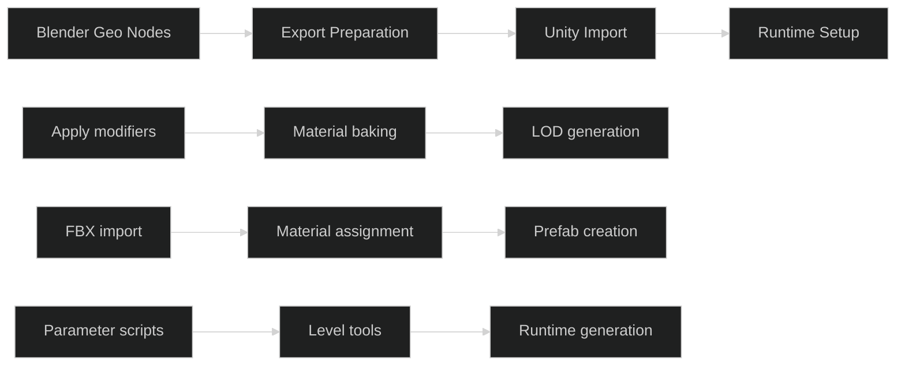

> [!example] Production Pipeline **Export preparation:**
> 
> 1. **Apply Geometry Nodes:** Bake procedural results to mesh
> 2. **LOD Generation:** Create multiple detail levels
> 3. **Material Baking:** Combine complex materials into textures
> 4. **UV Optimization:** Pack efficiently for engine import
> 
> **Engine integration:**
> 
> 1. **Prefab Setup:** Organize components for easy use
> 2. **Parameter Scripts:** Expose key controls to level designers
> 3. **Documentation:** Clear instructions for non-technical users

> [!tip] Pipeline Best Practices
> 
> - **Standardized naming:** Consistent conventions across projects
> - **Modular exports:** Separate components for flexibility
> - **Version tracking:** Clear file organization and change logs
> - **Testing workflow:** Regular validation on target platform

#### 🔄 Variation Prompts

|Use Case|Integration Approach|Special Considerations|
|---|---|---|
|**Runtime Generation**|Script-driven creation|Performance budgets, loading times|
|**Level Design Tools**|Editor-time generation|User experience, error handling|
|**Content Streaming**|Dynamic loading/unloading|Memory management, seamless transitions|

#### ⚡ Alternative Approaches

- 💾 **Full Baking:** Export only final geometry, maximum compatibility
- 🔄 **Hybrid Systems:** Some runtime, some baked content
- 🎮 **Engine-Native:** Use engine's built-in procedural tools
- ☁️ **Server Generation:** Generate content remotely, stream to clients

> [!warning] Integration Challenges
> 
> - **Tool differences:** Features available in creation tool vs. engine
> - **Performance gaps:** Editor performance vs. runtime performance
> - **Team coordination:** Different specialists using different tools
> - **Iteration speed:** How quickly can changes propagate through pipeline

> [!info] Engine-Specific Tools **Unity:**
> 
> - ProBuilder for runtime geometry creation
> - Visual Effect Graph for procedural effects
> - Custom editor tools for designer workflows
> 
> **Unreal:**
> 
> - Blueprint construction scripts
> - Procedural mesh component
> - Material parameter collections

#### 🎯 Transfer Challenge

Plan integration strategy for your current project:

- What needs to be procedural vs. baked?
- How will non-technical team members interact with the system?
- What performance requirements must the pipeline meet?

> [!success] Success Metric You have a smooth workflow from creation tool to game engine that supports both iteration speed and final performance requirements.

##
---

## Chapter 5: Practical Applications and Workflows

### 5.1 Environment Asset Creation

🎯 **Problem/Goal:** Building complete environment systems using procedural approaches.

#### 💡 Key Concepts

|System Level|Components|Connections|
|---|---|---|
|**Infrastructure**|Roads, utilities, boundaries|Layout foundation|
|**Primary Structures**|Buildings, landmarks, major features|Functional organization|
|**Secondary Elements**|Props, vegetation, details|Atmospheric enhancement|
|**Finishing Touches**|Lighting, effects, polish|Final presentation|

#### 🛠️ One Example Path: Medieval Village Complete System

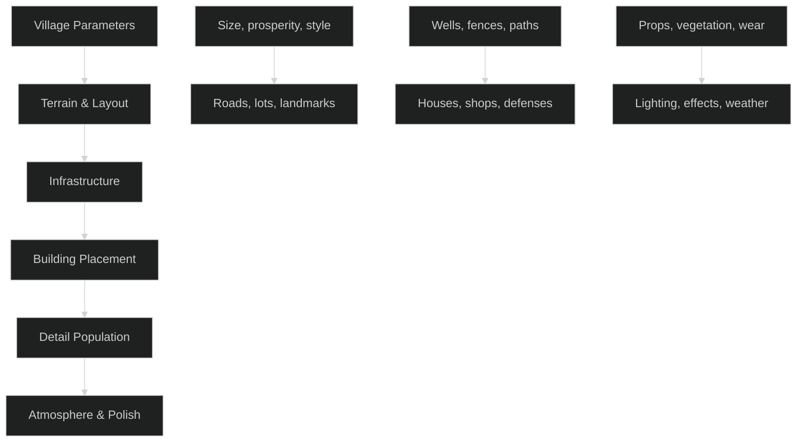

> [!example] Village System Implementation **Master control parameters:**
> 
> - Village size (small/medium/large)
> - Prosperity level (poor/modest/wealthy)
> - Defensive needs (peaceful/fortified/military)
> - Cultural style (generic/regional variants)
> 
> **System hierarchy:**
> 
> 1. **Terrain Foundation:** Generate or import landscape
> 2. **Road Network:** Main paths connecting to outside world
> 3. **Lot Division:** Parcels for different building types
> 4. **Building Placement:** Procedural architecture with variations
> 5. **Infrastructure:** Wells, market areas, defensive walls
> 6. **Detail Layer:** Props, vegetation, wear patterns
> 7. **Atmosphere:** Lighting, particle effects, ambient details

> [!tip] Environment System Design
> 
> - **Hierarchical dependency:** Each level builds on the previous
> - **Cultural consistency:** All elements should feel like they belong together
> - **Functional logic:** Consider how people would actually use the space
> - **Performance scaling:** System should work at different quality levels

#### 🔄 Variation Prompts

|Environment Type|Unique Considerations|System Adaptations|
|---|---|---|
|**Sci-Fi Cities**|Vertical construction, tech integration|Power grids, transport networks|
|**Natural Areas**|Organic growth patterns, ecosystem logic|Biome rules, succession modeling|
|**Interior Spaces**|Room function, circulation patterns|Furniture placement, lighting design|

#### ⚡ Alternative Approaches

- 🧩 **Kit-of-Parts:** Pre-made pieces arranged procedurally
- 🌱 **Full Procedural:** Everything generated from parameters
- 📋 **Template-Based:** Hand-crafted layouts with procedural variation
- 🎨 **Artist-Directed:** Procedural tools guided by manual art direction

> [!warning] Environment System Pitfalls
> 
> - **Uncanny valley:** Systems that feel too perfect or systematic
> - **Performance scaling:** Complex systems that don't optimize well
> - **Art direction loss:** Procedural systems overriding artistic vision
> - **Iteration difficulty:** Systems so complex they become hard to modify

#### 🎯 Transfer Challenge

Plan environment system for your game concept:

- What are the core environmental elements?
- How would you ensure variety while maintaining consistency?
- What level of procedural generation vs. manual art direction makes sense?

> [!success] Success Metric You can create compelling, believable environments that feel hand-crafted but benefit from procedural efficiency and variation.

###
---
### 5.2 Prop and Asset Development

🎯 **Problem/Goal:** Applying procedural thinking to smaller-scale asset creation.

#### 💡 Key Concepts

|Procedural Value|When It Applies|Implementation|
|---|---|---|
|**Variation Systems**|Multiple similar assets needed|Parameterized base with variations|
|**Customization**|Player or design choice required|Modular component assembly|
|**Iteration Speed**|Frequent design changes|Non-destructive parameter workflows|
|**Performance Scaling**|LOD or quality variants needed|Automated detail reduction|

#### 🛠️ One Example Path: Procedural Weapon Customization

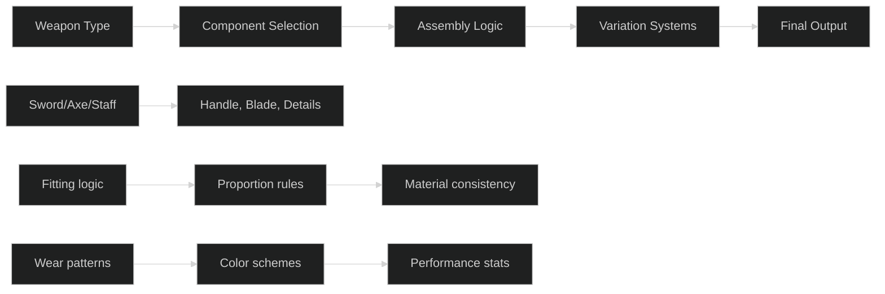

> [!example] Weapon Customization System **Component breakdown:**
> 
> 1. **Base Type:** Determines overall weapon category and stats
> 2. **Handle System:** Length affects reach, material affects durability
> 3. **Blade/Head:** Shape affects damage type, size affects power
> 4. **Detail Elements:** Decorative pieces, engravings, gems
> 5. **Wear System:** Usage-based deterioration and battle damage
> 
> **Procedural features:**
> 
> - **Auto-fitting:** Components adjust to work together properly
> - **Style consistency:** Decoration follows cultural/material themes
> - **Performance integration:** Visual choices affect gameplay stats
> - **Wear progression:** Procedural damage accumulation over time

> [!tip] Prop Procedural Guidelines
> 
> - **Clear use cases:** Not every prop benefits from procedural generation
> - **Art direction respect:** Systems should enhance, not replace, artistic vision
> - **Performance awareness:** Complex systems for simple props can be overkill
> - **User experience:** If designers will use it, make it intuitive

#### 🔄 Variation Prompts

|Prop Category|Procedural Opportunities|Design Considerations|
|---|---|---|
|**Furniture**|Style variants, wear, arrangement|Cultural consistency, functional requirements|
|**Vehicles**|Customization, damage, performance|Engineering logic, aesthetic coherence|
|**Architectural Details**|Regional variants, age, materials|Historical accuracy, structural logic|

#### ⚡ Alternative Approaches

- 🎯 **Full Procedural:** Everything parameterized and generated
- 🧩 **Modular Manual:** Hand-made pieces, procedural arrangement
- 📋 **Template Customization:** Base designs with procedural variation
- 🎨 **Artist-Guided Procedural:** Procedural tools controlled by manual art direction

> [!info] Prop Procedural Tools **Blender:**
> 
> - Geometry Nodes for component assembly
> - Material nodes for surface variation
> - Particle systems for detail distribution
> 
> **Game Engines:**
> 
> - Runtime component swapping
> - Shader parameter variation
> - Physics-based wear simulation

#### 🎯 Transfer Challenge

Identify procedural opportunities in your asset pipeline:

- What asset types get repeated with variations?
- Where do you spend time on manual, repetitive tasks?
- What would benefit from player or designer customization?

> [!success] Success Metric You can identify when procedural approaches add value to prop creation and implement systems that enhance rather than complicate the creative process.

##
---

## Conclusion: Connecting the Guides

**How critical thinking enhances procedural modeling:**

- **Problem decomposition** helps break complex geometry challenges into manageable systems
- **Research skills** help you find and adapt techniques from different domains
- **Iterative approaches** let you test and refine procedural systems efficiently
- **Documentation practices** help you build reusable procedural libraries

**How procedural projects develop problem-solving skills:**

- **Systematic thinking** becomes second nature when building modular systems
- **Parameter relationships** teach cause-and-effect reasoning
- **Debugging procedural systems** builds logical troubleshooting skills
- **Optimization constraints** force creative problem-solving within limits

> [!summary] Building Your Personal Toolkit
> 
> - Start with simple systems and gradually increase complexity
> - Build libraries of reusable components and techniques
> - Document your successful approaches for future projects
> - Study how others solve similar challenges and adapt their methods

> [!note] Next Steps for Continued Learning
> 
> 1. Practice these concepts on personal projects
> 2. Experiment with different procedural tools and workflows
> 3. Join communities focused on procedural content creation
> 4. Analyze existing games to understand their procedural systems

> [!quote] Remember Procedural modeling isn't about replacing artistic skill - it's about amplifying it. The goal is to spend more time on creative decisions and less time on repetitive tasks, while maintaining the ability to iterate and experiment freely.

The thinking patterns you develop here apply beyond geometry - to materials, animation, level design, and any systematic creative work.

##
---
---