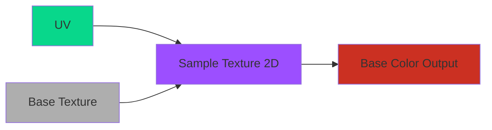
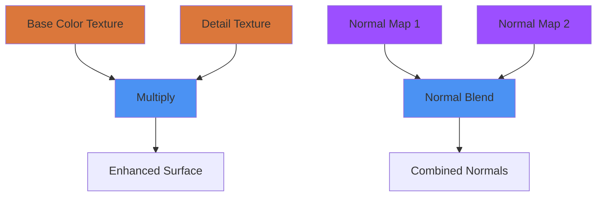
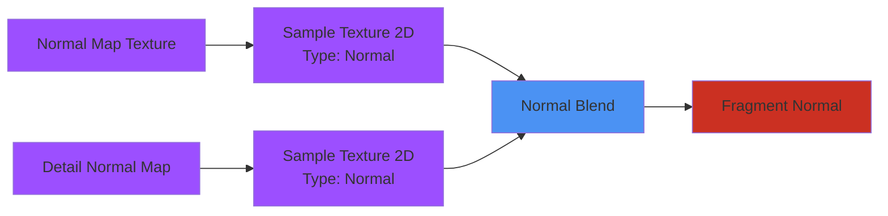
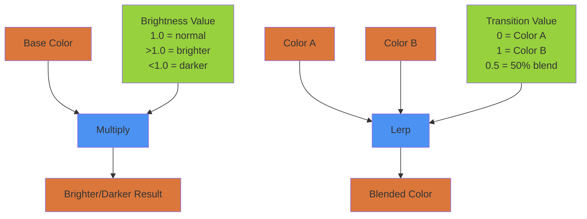
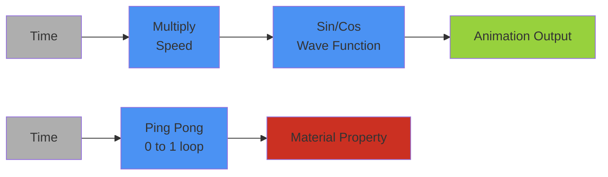
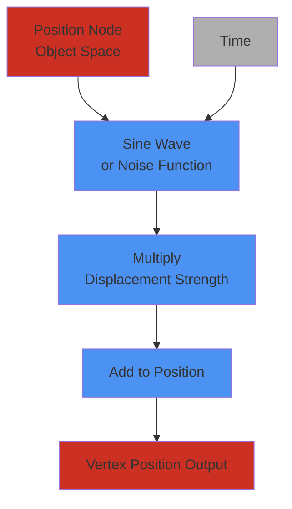
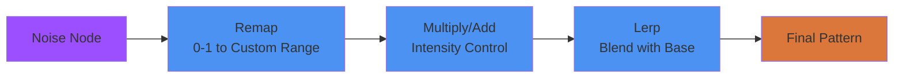
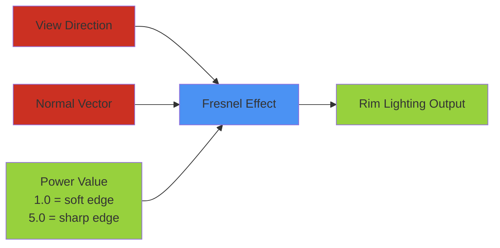

# Module 2D: Additional Shader Graph Techniques

> [!info] Module Overview 
> **Learning Focus:** Mastering sophisticated Shader Graph operations for professional-quality materials 
> **Builds On:** Interface understanding and basic node connections from Module 2C

---

## 🎨 Texture Mapping and Blending Fundamentals

Understanding how to work with textures in Shader Graph opens the door to creating sophisticated, detailed materials. The process builds upon the basic color control concepts from our previous module, but introduces the complexity of working with image data and combining multiple visual elements.

When you sample a texture in Shader Graph, you're essentially telling the GPU to look up color information from a 2D image at specific coordinates. The Sample Texture 2D node performs this operation, taking UV coordinates as input and returning color data as output. 



### 🔗 Building Complex Material Systems Through Blending

The real power of texture mapping emerges when you begin combining multiple textures to create materials that feel rich and detailed. The `Lerp` (Linear Interpolation) node becomes your primary tool for blending different visual elements together. When you use a Lerp node, you're creating a smooth transition between two input textures based on a third input that acts as a blending mask.

Consider how this might work in practice: you could blend between a clean metal texture and a rusted metal texture using a noise pattern as your mask. Areas where the mask is white would show the clean metal, areas where the mask is black would show the rusted version, and gray areas would create a smooth blend between the two states.


> [!example] **Essential Texture Blending Pattern**
```
Texture A (Clean Metal) ────┐
                            ├── LERP ──► Blended Result
Texture B (Rusted Metal) ───┘     ▲
                                 │
Noise Mask (Black/White) ─────────┘
```


<iframe width="560" height="315" src="https://www.youtube.com/embed/zt21itB0ESw?si=hzZWxC0AvGoHWa-I" title="YouTube video player" frameborder="0" allow="accelerometer; autoplay; clipboard-write; encrypted-media; gyroscope; picture-in-picture; web-share" referrerpolicy="strict-origin-when-cross-origin" allowfullscreen></iframe>

### 🎯 Adding Detail Through Layered Textures

Professional materials often use multiple texture layers to achieve convincing results (this is a physically-based rendering approach or PBR). The `Multiply` node becomes particularly useful when adding detail textures that enhance rather than replace your base material information. When you multiply a detail texture with your base color, darker areas of the detail texture will darken the base color, while lighter areas will leave it relatively unchanged. This creates the impression of surface variation and detail without completely obscuring your primary texture.



---

## 🗺️ Normal Mapping and Advanced Surface Detail

Normal mapping represents one of the most impactful techniques available in modern game development, allowing you to add the visual impression of detailed surface geometry without the performance cost of additional polygons.

### 🔍 Understanding Normal Map Technology

A normal map stores surface direction information in the red, green, and blue channels of a texture, with each color channel representing direction along a different axis. When the lighting system calculates how light should interact with your surface, it uses this direction information to simulate bumps, crevices, and other surface irregularities that don't actually exist in your 3D geometry.

>[!example] **RGB Channel Breakdown**
```
Normal Map Channels:
🔴 Red   = X-axis direction (left/right bumps)
🟢 Green = Y-axis direction (up/down bumps)  
🔵 Blue  = Z-axis direction (in/out depth)

Purple color = pointing toward camera
```

The Sample Texture 2D node can read normal map data, but you need to ensure that Unity interprets this data correctly. Setting the node's Type parameter to "Normal" tells Unity to treat the RGB values as direction vectors rather than color information. This distinction is crucial because normal maps require special mathematical processing to work properly with lighting calculations.


> [!tip] **Essential Normal Mapping Resources**
> 
> Understanding the theory behind normal mapping will improve your practical application:
> 
> - [This is Normal - ArtStation](https://www.artstation.com/blogs/typhen/GMyG/this-is-normal-1-what-normal-maps-are-and-how-they-work)
> - [What is Normal Mapping? - Adobe](https://www.adobe.com/products/substance3d/discover/normal-mapping.html)

### 🔄 Blending Multiple Normal Maps

Professional materials often combine multiple normal maps to achieve different scales of surface detail. You might use one normal map to simulate large-scale surface features like scratches or dents, while using a second normal map to add fine-scale texture like fabric weave or metal grain.



When blending normal maps, it's important to understand that you're not simply adding color values together. Normal maps represent direction vectors, so combining them requires vector mathematics to ensure that the resulting surface directions remain physically plausible. The `Normal Blend` node handles these calculations automatically.

---

## ⚡ Dynamic Shader Operations and UV Manipulation

Creating materials that feel alive and responsive requires understanding how to manipulate various shader inputs dynamically. These techniques allow for materials that can change and respond to different conditions within your game state or gameplay mechanics.

### 🌈 Color Adjustments and Dynamic Material Properties

The ability to adjust material colors dynamically opens up numerous gameplay possibilities. You might change a character's armor color to reflect different factions, or shift environmental materials to indicate different gameplay states. The basic mathematical nodes in Shader Graph—`Add`, `Multiply`, and `Lerp`—become useful tools for creating these dynamic color systems.



Understanding how these operations affect color can help you achieve specific visual goals. Multiplying a color by a value greater than one will brighten it, while multiplying by a value less than one will darken it. Adding a color value will shift the overall hue, which can be useful for creating lighting effects or magical glows. The Lerp node allows you to smoothly transition between different color states, perfect for creating materials that change over time or in response to player actions.

### 🗺️ UV Manipulation for Texture Animation

UV coordinates determine how textures map onto your 3D geometry, but they don't have to remain static! By manipulating UV coordinates, you can create scrolling textures, rotating patterns, and other animated effects that bring your materials to life. The `Tiling and Offset` node provides the base these parameters, allowing you to scale and move your texture mapping in real time.

```txt
UV Coordinates ──► Tiling and Offset ──► Animated UVs
                        ▲
                        │
    Time ──► Multiply ──┘
           (Speed Control)

```
> [!example] **Common UV Animation Patterns**
Scrolling Water:  `UV.X += Time * Speed`
Rotating Portal:  `UV = Rotate(UV, Time * RotationSpeed)`  
Pulsing Scale:    `UV *= 1 + Sin(Time) * 0.1`

<iframe width="560" height="315" src="https://www.youtube.com/embed/gJMeSkolnw4?si=m7Dfpt4bsLcaQ3Ax" title="YouTube video player" frameborder="0" allow="accelerometer; autoplay; clipboard-write; encrypted-media; gyroscope; picture-in-picture; web-share" referrerpolicy="strict-origin-when-cross-origin" allowfullscreen></iframe>

### ⏱️ Time-Based Animation Systems

The `Time` node in Shader Graph provides access to various time values that you can use to drive animations. Understanding the different time outputs helps you choose the right one for your specific needs. The basic Time output provides the number of seconds since the application started, making it perfect for continuous animations like scrolling textures or pulsing lights.



When using time-based animations, consider how they will feel to players over extended gameplay sessions. Subtle, slow animations often work better than rapid, dramatic changes because they provide visual interest without becoming distracting or visually tiresome.

<iframe width="560" height="315" src="https://www.youtube.com/embed/MbD6ZTupmws?si=bHRxwZlEQpZAsHzb" title="YouTube video player" frameborder="0" allow="accelerometer; autoplay; clipboard-write; encrypted-media; gyroscope; picture-in-picture; web-share" referrerpolicy="strict-origin-when-cross-origin" allowfullscreen></iframe>

---

## 🌊 Vertex Displacement and Geometric Animation

Vertex displacement represents a powerful technique for creating materials that actually modify the shape of your geometry rather than just changing its surface appearance. This capability opens up possibilities for effects like rippling water, swaying foliage, or morphing surfaces.

### 📐 Understanding Vertex Operations

When you modify vertices in a shader, you're changing the actual 3D positions of points that make up your geometry. This (typically) happens before the lighting calculations, which means that displaced vertices will cast shadows and interact with lighting exactly as if the geometry were actually shaped that way. The `Position` node provides access to vertex position data, which you can then modify using mathematical operations.



The key to effective vertex displacement lies in understanding that you're working with the original vertex positions, not the final screen positions. This means you need to think in terms of local object space when designing your displacement effects. Moving a vertex along its normal direction will push it outward from the surface, while moving it along world space axes will create directional displacement effects.

### 🌊 Creating Natural Motion with Sine Waves

Sine waves provide an excellent foundation for creating natural-looking motion because they produce smooth, cyclical changes that feel organic. When you combine the Sine node with the Time node, you create oscillating displacement that can simulate phenomena like water waves, breathing motions, or magical energy effects.

> [!example] **Basic Wave Displacement**
```hlsl
// Simple sine wave
Position.y += sin(Position.x + Time * Speed) * Amplitude

// Multi-directional waves
Position.y += sin(Position.x + Time * 2) * 0.1 +
              cos(Position.z + Time * 1.5) * 0.05

// Circular ripples
Distance = length(Position.xz)
Position.y += sin(Distance * Frequency + Time * Speed) * Amplitude
```

Understanding how to modify sine wave behavior allows you to fine-tune your effects for different visual goals. Multiplying the time input changes the frequency of oscillation, while multiplying the output changes the amplitude or strength of the displacement. Adding an offset to the time input can create phase differences between different parts of your geometry, resulting in wave-like motion that travels across your surface.

<iframe width="560" height="315" src="https://www.youtube.com/embed/IjfBlUtJF_0?si=X16DgtXyt6zvYTqa" title="YouTube video player" frameborder="0" allow="accelerometer; autoplay; clipboard-write; encrypted-media; gyroscope; picture-in-picture; web-share" referrerpolicy="strict-origin-when-cross-origin" allowfullscreen></iframe>


---

## 🎨 Procedural Pattern Generation with Noise

Noise functions represent the core of creating natural-looking, varied materials without requiring hand-painted textures. 

### 🌪️ Understanding Different Noise Types

*Perlin Noise* creates soft, organic patterns that work well for simulating natural phenomena like clouds, terrain variation, or organic surface textures. The gradual transitions and flowing patterns make it ideal for situations where you want variation that feels natural rather than chaotic.

*Voronoi Noise* generates cellular patterns that resemble cracked earth, animal skin patterns, or crystalline structures. The sharp boundaries between cells create a different aesthetic that can be useful for more geometric or structured procedural textures.

*Gradient Noise* provides another option for soft transitions (Perlin noise is actually a form of gradient noise) and blending effects, with characteristics that fall somewhere between Perlin and other noise types. Understanding when to use each type of noise comes with experience and experimentation.


####  Noise Type Comparison

|Noise Type|Visual Pattern|Best For|
|---|---|---|
|**Perlin**|Smooth, flowing|Clouds, terrain, organic textures|
|**Voronoi**|Cellular, cracked|Stone patterns, cell structures|
|**Gradient**|Soft transitions|Blending masks, subtle variation|
|**Simple**|Basic random|Quick placeholder patterns|


<iframe width="560" height="315" src="https://www.youtube.com/embed/jAOqmx764dA?si=8v9vrI1ifCuHEORZ" title="YouTube video player" frameborder="0" allow="accelerometer; autoplay; clipboard-write; encrypted-media; gyroscope; picture-in-picture; web-share" referrerpolicy="strict-origin-when-cross-origin" allowfullscreen></iframe>

### 🔧 Advanced Noise Manipulation Techniques

The `Remap` node becomes particularly powerful when working with noise because it allows you to control exactly how noise values translate into visual effects. By remapping noise from its default range to different values, you can create sharp contrasts, soft gradients, or any variation in between.



Combining multiple noise patterns at different scales creates the kind of complex, layered variation that characterizes high-quality procedural materials. You might use large-scale noise to control primary color variation, medium-scale noise for texture detail, and small-scale noise for surface roughness variation. The `Lerp` and `Multiply` nodes help you blend these different scales of variation together effectively.

```
Large Scale Noise (0.1 frequency) ──┐
                                    ├── Add ──► Complex Pattern
Medium Scale Noise (0.5 frequency) ─┤
                                    │
Fine Detail Noise (2.0 frequency) ──┘
```

---

## 💡 Custom Lighting and Advanced Visual Effects

While Unity provides excellent built-in lighting systems (as we have seen already), understanding how to create custom lighting effects gives you additional creative control and allows you to achieve specific artistic styles that might not be possible with standard lighting alone.

### 🌟 Understanding Fresnel and Rim Lighting Effects

Fresnel effects occur naturally when light interacts with surfaces at glancing angles, creating bright edges and darker center areas. The `Fresnel` node in Shader Graph simulates this phenomenon, allowing you to create rim lighting effects that highlight the edges of objects. This technique is particularly effective for creating magical glows, force field effects, or simply enhancing the visual separation between objects and their backgrounds.



> [!example] **Fresnel Applications**
```
Rim Lighting:     Fresnel * Color * Intensity
Force Fields:     Fresnel * Pulsing Animation
Glass Materials:  1 - Fresnel (inverted for transparency)
Energy Effects:   Fresnel * Noise * Bright Color
```

<iframe width="560" height="315" src="https://www.youtube.com/embed/ldtY-qwrm00?si=TPtMoWE9L7DnxDSS" title="YouTube video player" frameborder="0" allow="accelerometer; autoplay; clipboard-write; encrypted-media; gyroscope; picture-in-picture; web-share" referrerpolicy="strict-origin-when-cross-origin" allowfullscreen></iframe>

---

## 🎯 Learning Check: Advanced Technique Integration

> [!question] 🤔 **Synthesis Exercise (8-10 minutes)**
> 
> Think about a specific visual effect you'd like to create for a game project—perhaps magical energy, flowing water, weathered metal, or organic growth patterns. Consider how you might combine the techniques covered in this module to achieve that effect.
> 
> **Consider these technical approaches:**
> 
> - Which types of noise would be most appropriate for your effect?
> - How might you use UV animation to enhance the sense of movement or change?
> - Would vertex displacement add to the convincing nature of your effect?
> - How could custom lighting or rim effects enhance the overall impression?
> 
> **Sketch out a node flow** (even just with words) that describes how you would approach building this effect step by step, building from simple base elements to more complex combined results.

---

## 🔗 Integration with Broader Development Pipeline

Understanding how these advanced techniques connect to your overall game development workflow helps you see their practical applications beyond pure visual experimentation. The sophisticated materials you can create with these techniques become valuable assets that can enhance player engagement and support your game's overall design goals.

### 🎮 Performance Considerations for Advanced Effects

As your shaders become more sophisticated, maintaining good performance becomes increasingly important. Vertex displacement effects can be particularly expensive because they require additional geometry to look smooth, while complex noise calculations can impact fragment shader performance. Understanding these trade-offs helps you make informed decisions about when to use advanced techniques and when simpler approaches might be more appropriate.

#### ⚡ Shader Complexity Guidelines
> [!warning] **Performance Hierarchy (Most to Least Expensive)**
> 
> 1. **Vertex Displacement** - Requires dense geometry
> 2. **Multiple Texture Samples** - Memory bandwidth heavy
> 3. **Complex Math Operations** - Sin, Cos, Pow functions
> 4. **Simple Math** - Add, Multiply, Lerp
> 5. **Property Lookups** - Colors, single values

The key lies in matching your shader complexity to your specific platform and performance requirements. Mobile games might require more conservative approaches, while high-end PC games can afford more sophisticated effects.

---

## 🚀 Next: Module 2E - Shader Integration and Optimization

**Coming up:** We'll explore how to integrate shaders with game systems and understand how shaders fit into the broader rendering pipeline.

> [!info] 📍 Progress Tracking
> 
> - [x] Module 2A: Shader Fundamentals and Concepts ✓
> - [x] Module 2B: Shader Development Workflow and 3D Integration ✓
> - [x] Module 2C: Unity Shader Graph Introduction ✓
> - [x] Module 2D: Advanced Shader Graph Techniques ✓
> - [ ] Module 2E: Shader Integration and Optimization

---

> [!info] 🧭 Module Navigation 
> **Previous:** [[GMAP 395 - Module 2C - Unity Shader Graph Intro|Module 2C]]  
> **Next:** [[GMAP 395 - Module 2E - Shader Integration|Module 2E]]  
> **Return to:** [[GMAP 395 - Module 2|Module Page]]