# Module 2E: Shader Integration and Optimization

> [!info] Module Overview 
> **Learning Focus:** Understanding shader performance, game system integration, and professional development practices 
> **Builds On:** Advanced techniques and practical implementation from Module 2D

> [!summary] Submodule Video Overview
> <iframe src="https://1drv.ms/v/c/b08de2251f1b33a4/IQTNDnkuxUN_TpK4a7XS61JZASpLhA4XOy1ALoN3X53dczw?width=2560&height=1440" width="800" height="600" frameborder="0"></iframe>
> 
> [gmap395_md2e.mkv](https://1drv.ms/v/c/b08de2251f1b33a4/Ec0OeS7FQ39OkrhrtdLrUlkBMQst0txb7lWQV2PG5bTBnw?e=7pzoxH)

---

## 🔄 Understanding Shaders in the Rendering Pipeline

To truly master shader development, you need to understand exactly where shaders fit within the broader process of converting 3D data into the images players see on their screens.

<iframe width="560" height="315" src="https://www.youtube.com/embed/oLiJTcdBCkM?si=lUZch6a5srRFLjEu" title="YouTube video player" frameborder="0" allow="accelerometer; autoplay; clipboard-write; encrypted-media; gyroscope; picture-in-picture; web-share" referrerpolicy="strict-origin-when-cross-origin" allowfullscreen></iframe>

### 🎯 The Complete Rendering Pipeline


![[GMAP 395/Module 2/media/renderPipeline.jpg]]


### 🔺 Vertex Processing → Fragment Processing Flow

> [!example] **Data Transformation Stages**
> 
> ```
> Model Space Vertices ──► World Space ──► Screen Space
>         ▲                    ▲              ▲
>    Original Mesh        Transformed    Final Positions
>                                           
> Vertex Attributes ──► Interpolation ──► Fragment Data
>  (UV, Normal, Color)    (Rasterizer)    (Per-Pixel)
> ```

Understanding this timing helps you appreciate why **vertex displacement creates convincing effects** compared to texture-based illusions—displaced vertices participate in shadow casting and lighting calculations.


### 🎨 Blending and Output Merging


<iframe width="560" height="315" src="https://www.youtube.com/embed/C8YtdC8mxTU?si=npBTMSnBA2V1UmWN" title="YouTube video player" frameborder="0" allow="accelerometer; autoplay; clipboard-write; encrypted-media; gyroscope; picture-in-picture; web-share" referrerpolicy="strict-origin-when-cross-origin" allowfullscreen></iframe>

> [!tip] **Deep Dive Resource** [OpenGL Rendering Pipeline Overview](https://www.khronos.org/opengl/wiki/Rendering_Pipeline_Overview) provides comprehensive technical details about how graphics pipelines function at a low level.

---

## 🎮 Connecting Shaders to Game Systems Through Code

The real power of shaders in game development emerges when you connect them dynamically to your game's systems and logic. This integration transforms static visual elements into responsive, interactive components.

### 🔧 Dynamic Material Property Control


When you expose properties in your Shader Graph through the Blackboard, Unity automatically makes these properties available to your C# scripts through the Material class.

```csharp
using UnityEngine;

public class MaterialController : MonoBehaviour
{
    public Material dynamicMaterial;
    public float pulseSpeed = 2f;

    void Update()
    {
        // Create a pulsing emission effect using time-based animation
        float emission = Mathf.PingPong(Time.time * pulseSpeed, 1f);
        dynamicMaterial.SetFloat("_EmissionIntensity", emission);
    }

    public void SetDamageEffect()
    {
        // Flash red when the character takes damage
        dynamicMaterial.SetColor("_BaseColor", Color.red);
    }
    
    public void RestoreNormalColor()
    {
        // Return to the original color after damage effect
        dynamicMaterial.SetColor("_BaseColor", Color.white);
    }
}
```

### 🎯 Real-World Integration Examples

> [!example] **Professional Game Applications**
> 
> ```
> Health Systems:     Material.SetFloat("_DamageAmount", healthPercentage)
> Interactive Objects: Material.SetFloat("_GlowIntensity", proximityValue)  
> Environmental Story: Material.SetColor("_CorruptionColor", storyProgress)
> Achievement Visual:  Material.SetFloat("_CompletionGlow", achievementState)
> ```

Understanding these broader applications helps you think creatively about how material control can support your game's design goals beyond purely aesthetic considerations.

---

## 🎬 Animation and Tweening Integration for Smooth Transitions

Creating smooth, polished visual transitions requires understanding how to integrate shader property changes with animation systems. Professional games rarely make abrupt visual changes because smooth transitions feel more natural.

>[!hint] [DOTween](https://assetstore.unity.com/packages/tools/animation/dotween-hotween-v2-27676) is recommended. Check out the [documentation](http://dotween.demigiant.com/documentation.php) here!

### 🔄 Tweening Architecture


### 🎨 Advanced Animation Sequences

```csharp
using DG.Tweening;
using UnityEngine;

public class MaterialAnimator : MonoBehaviour
{
    public Material targetMaterial;
    
    void Start()
    {
        // Create a looping color animation that cycles between blue and red
        targetMaterial.DOColor(Color.blue, "_EmissionColor", 2f)
            .SetLoops(-1, LoopType.Yoyo);
    }
    
    public void TriggerPowerUpEffect()
    {
        // Animate multiple properties simultaneously for a power-up effect
        Sequence powerUpSequence = DOTween.Sequence();
        powerUpSequence.Append(targetMaterial.DOFloat(2f, "_EmissionIntensity", 0.5f));
        powerUpSequence.Join(targetMaterial.DOColor(Color.yellow, "_BaseColor", 0.5f));
        powerUpSequence.AppendInterval(1f);
        powerUpSequence.Append(targetMaterial.DOFloat(0f, "_EmissionIntensity", 0.5f));
        powerUpSequence.Join(targetMaterial.DOColor(Color.white, "_BaseColor", 0.5f));
    }
}
```

> [!tip] **Animation Parameter Types**
> 
> ```
> SetFloat() ──► Emission intensity, displacement strength, noise scale
> SetColor() ──► Base color, emission color, rim light color  
> SetVector() ──► UV offsets, direction vectors, multi-parameter controls
> SetTexture() ──► Swapping textures for state changes
> ```

The key insight: **any parameter you can control through code can also be animated through tweening**, opening up sophisticated visual sequences that respond to gameplay events with precisely timed material changes.

---

## 🎯 Professional Case Studies and Industry Applications

Examining how successful games use shader techniques provides valuable insights into professional development practices and helps you understand the strategic thinking behind visual design decisions.

### 🎮 Case Study Matrix

|Game|Technique|Implementation|Strategic Purpose|
|---|---|---|---|
|**Borderlands**|Cel-shading|Custom ramp textures + sharp light transitions|Distinctive comic book aesthetic|
|**Sea of Thieves**|Water simulation|Multi-layer vertex displacement + surface shaders|Gameplay clarity + visual appeal|
|**Control**|Reality shifts|Blendable material states + trigger systems|Interactive storytelling support|
|**Halo**|Hologram effects|Vertex distortion + additive transparency|Sci-fi atmosphere + UI integration|

### 🌊 Technical Implementation Breakdown: Dynamic Water


The strategic aspect involves **balancing visual sophistication with gameplay requirements**—water needs to look convincing while clearly communicating navigation information.

### 🔮 Material State Transitions: Interactive Environments

```
Normal State ──► Trigger Event ──► Transition Shader ──► New State
     ▲                                                       │
     └─────────────── Return Event ◄─────────────────────────┘

// Example: Control's reality-shifting walls
Material.SetFloat("_TransitionAmount", 0f → 1f → 0f)
```

> [!example] **Professional Shader Integration Patterns**
> 
> ```
> Performance Scaling: LOD materials for different distances
> Platform Adaptation: Mobile vs PC shader complexity variants  
> Gameplay Integration: Health/status reflected in visual materials
> Environmental Systems: Time-of-day affecting material appearance
> ```

---

## ⚡ Performance Optimization and Debugging Strategies

Creating shaders that perform well across different hardware configurations requires understanding both technical constraints and practical measurement techniques.

### 📊 GPU Performance Bottleneck Hierarchy


### 🔧 Optimization Strategy Decision Tree

```mermaid
graph TD
    A[Target Platform?] --> B{Mobile}
    A --> C{PC/Console}
    
    B --> D[Aggressive Optimization<br/>• Single texture samples<br/>• Simple noise only<br/>• No vertex displacement<br/>• Minimal math operations]
    
    C --> E[Performance Budget?]
    E --> F{High-End}
    E --> G{Mid-Range}
    
    F --> H[Full Complexity<br/>• Multiple texture layers<br/>• Complex displacement<br/>• Advanced lighting]
    
    G --> I[Balanced Approach<br/>• Moderate texture use<br/>• Simple displacement<br/>• Efficient lighting]
    
    style B fill:#CB3022
    style D fill:#CB3022
    style F fill:#97D13D
    style H fill:#97D13D
    style G fill:#DB773B
    style I fill:#DB773B
```



### 🎯 Practical Debugging Workflow

> [!success] **Unity Debugging Tools**
> 
> **Frame Debugger** (`Window > Analysis > Frame Debugger`)
> 
> - See exactly how your shader renders step-by-step
> - Identify performance bottlenecks and unexpected behavior
> 
> **Scene View Debug Modes** (`Scene View > Debug Shading Modes`)
> 
> - Isolate specific material components (albedo, normals, etc.)
> - Verify shader behavior under controlled conditions
> 
> **Material Inspector Debug Properties**
> 
> - Expose internal shader values for real-time tweaking
> - Test edge cases and parameter ranges

Professional debugging often involves **systematically testing materials under different conditions** to ensure consistent behavior across various gameplay scenarios.

### 📐 Scalable Material Design Patterns

```
Base Material Template
├── Mobile Variant (LOD 0)
│   ├── Single texture sample
│   ├── Simple color operations
│   └── No vertex displacement
├── Standard Variant (LOD 1)  
│   ├── 2-3 texture samples
│   ├── Basic normal mapping
│   └── Simple vertex effects
└── High-End Variant (LOD 2)
    ├── Multiple texture layers
    ├── Complex normal blending
    └── Advanced displacement
```

> [!warning] **Performance Optimization Guidelines**
> 
> ```
> Texture Memory:    Pack multiple maps into single textures (RGBA channels)
> Math Operations:   Use Lerp instead of complex conditional logic
> Vertex Density:    Match geometry resolution to displacement complexity  
> Platform Testing:  Always test on target hardware, not just editor
> ```

---

## 🔄 Shader Graph vs. Hand-Written Code: Strategic Considerations

Understanding when to use visual shader tools versus traditional shader coding helps you choose the most appropriate approach for different development scenarios.

### 🎨 Tool Comparison Matrix

|Aspect|Shader Graph|Hand-Written HLSL|
|---|---|---|
|**Learning Curve**|Low - Visual interface|High - Programming knowledge required|
|**Iteration Speed**|Fast - Immediate preview|Slow - Compile/test cycles|
|**Performance Control**|Limited optimization|Full optimization control|
|**Effect Complexity**|Moderate - Node limitations|Unlimited - Direct GPU programming|
|**Team Collaboration**|Excellent - Visual communication|Limited - Code expertise required|
|**Platform Optimization**|Automatic variants|Manual per-platform coding|

### 🔧 Decision Framework


### 🌉 Bridging Both Approaches

> [!tip] **Professional Development Strategy**
> 
> **Start with Shader Graph for:**
> 
> - Rapid prototyping and concept validation
> - Team communication and visual documentation
> - Standard material effects and variations
> 
> **Transition to Hand-Written when:**
> 
> - Performance optimization becomes critical
> - Custom lighting models are required
> - Platform-specific adaptations are needed
> - Advanced techniques exceed Shader Graph capabilities

The visual logic you create in Shader Graph corresponds directly to operations you would write in shader code, so **experience with one approach supports learning the other**.edge rendering techniques, the flexibility of direct code often becomes necessary.

Complex lighting models, advanced post-processing effects, and highly optimized mobile shaders often require the precision and control that only *hand-written code* can provide. Understanding both approaches helps you choose the right tool for each specific situation.

---

## 🎯 Learning Check: Integration Synthesis

> [!question] 🤔 **Professional Application Exercise (10-12 minutes)**
> 
> Consider a specific game project you might work on (either real or hypothetical). Think about how the integration concepts from this module could enhance player experience and support your game's design goals.
> 
> **Integration Planning Matrix:**
> 
> |System|Material Response|Code Integration|Performance Impact|
> |---|---|---|---|
> |**Health System**|Red damage flash, healing glow|`SetFloat("_DamageAmount")`|Low - single property|
> |**Environment**|Weather effects, time-of-day|`SetColor("_AmbientTint")`|Medium - multiple materials|
> |**Interactions**|Proximity highlighting|`SetFloat("_GlowIntensity")`|Low - distance-based|
> |**Progression**|Upgrade visual effects|`SetTexture("_UpgradeState")`|High - texture swapping|
> 
> **Consider these questions:**
> 
> - How could dynamic material responses provide valuable feedback to players?
> - What performance constraints would you need to consider for your target platform?
> - How might your materials need to integrate with other systems like lighting or particle effects?
> 
> **Write a brief integration plan** that describes your approach to material development within a larger game development effort.

---

## 🌟 Looking Forward: Shaders in Modern Game Development

Understanding current trends and future directions in shader development helps you prepare for evolving industry requirements and technological opportunities.

### 🚀 Emerging Technology Impact


### 🎯 Professional Skill Development Path

> [!success] **Building Expertise Roadmap**
> 
> **Foundation Level** (Current Module Focus)
> 
> - ✅ Shader Graph proficiency
> - ✅ Material system integration
> - ✅ Performance optimization basics
> - ✅ Game system connections
> 
> **Intermediate Development**
> 
> - Hand-written HLSL shader creation
> - Custom lighting model implementation
> - Platform-specific optimization techniques
> - Advanced procedural content integration
> 
> **Advanced Specialization**
> 
> - Real-time ray tracing shader development
> - AI-assisted content generation workflows
> - Cross-platform rendering pipeline design
> - Technical art leadership and team coordination

---

## 🎯 Module Summary and Professional Context

This module has covered the essential concepts for integrating shader development into professional game development workflows. You've learned how shaders fit into the rendering pipeline, how to connect them dynamically to game systems, and how to approach performance optimization systematically.

### 🔗 Key Integration Concepts

The integration between technical skill and creative vision that shader development requires reflects broader patterns in modern game development. The most successful projects emerge from teams that can balance artistic goals with technical constraints while maintaining focus on player experience.

> [!example] **Professional Shader Development Mindset**
> 
> ```
> Creative Vision ──┐
>                    ├── Balanced Implementation ──► Player Experience
> Technical Reality─┘
> 
> Consider simultaneously:
> • Visual impact and artistic goals
> • Performance constraints and platform limits  
> • Team workflow and collaboration needs
> • Player feedback and usability requirements
> ```

---
> [!info] 📍 Progress Tracking
> 
> - [x] Module 2A: Shader Fundamentals and Concepts ✓
> - [x] Module 2B: Shader Development Workflow and 3D Integration ✓
> - [x] Module 2C: Unity Shader Graph Introduction ✓
> - [x] Module 2D: Advanced Shader Graph Techniques ✓
> - [x] Module 2E: Shader Integration and Optimization ✓

---

> [!info] 🧭 Module Navigation
>  **Previous:** [[GMAP 395 - Module 2D - Additional Shader Graph Techniques|Module 2D]]  
> **Return to:** [[GMAP 395 - Module 2|Module Page]]  
