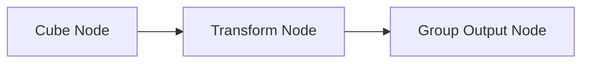
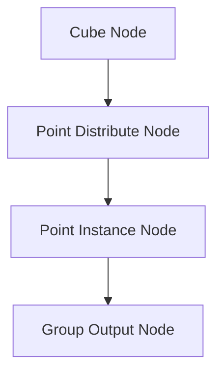

# Week 1 - Part 1: Procedural Modeling with Blender Geometry Nodes

## 🌟 Introduction

Welcome to Week 1 of Advanced Game Art and Production! In this tutorial, we will explore **procedural modeling** using Blender Geometry Nodes. By the end of this session, you’ll have a strong foundation in creating modular assets procedurally, which can be adapted for various applications in game art. This tutorial is designed to be **generic and reusable** for future iterations of this course.

---

## 🎯 Objectives

- 🛠 Understand the basics of Blender Geometry Nodes.
- 🧩 Create a **modular artifact** (e.g., a crystal or mechanical structure) using procedural techniques.
- 🔄 Apply procedural methods to generate variations of the artifact.
- 📤 Save and export assets for integration into game engines like Unity or Unreal.

---

## 1️⃣ Introduction to Blender Geometry Nodes

### 💡 1.1 What are Geometry Nodes?

Geometry Nodes is a procedural modeling tool in Blender that allows users to create, modify, and manipulate geometry using a node-based system. This method provides:

- ✅ Flexibility to create modular assets.
- ✅ Non-destructive workflows.
- ✅ Easy parameter adjustments for generating variations.

> [!info] **Resources**
> 
> - [Blender Documentation: Geometry Nodes](https://docs.blender.org/manual/en/latest/modeling/geometry_nodes/index.html)
> - [Beginner Tutorial: Geometry Nodes (YouTube)](https://www.youtube.com/watch?v=example)

### 🛠 1.2 Setting Up Your Workspace

1. Open Blender and switch to the **Geometry Nodes** workspace.
2. Add a **Plane** to your scene (Shift + A > Mesh > Plane).
3. Select the plane and open the **Geometry Nodes** editor.
4. Click **New** to create a Geometry Nodes modifier.

> [!tip] **Save Your Work** Save your Blender project regularly to avoid losing progress.

---

## 2️⃣ Building the Artifact Base

### 🔨 2.1 Creating a Modular Base

1. Delete the **Group Input** node.
2. Add a **Cube** node (Shift + A > Mesh > Cube) and connect it to the **Group Output** node.
3. Add a **Transform** node (Shift + A > Geometry > Transform) to adjust the cube’s position and scale.
4. Use the **Transform** node to:
    - 🔍 Scale the cube to a base size (e.g., 1x1x1).
    - 🔄 Offset the position if needed.

### 🧱 2.2 Adding Detail with Instances

1. Add a **Point Distribute** node (Shift + A > Point > Point Distribute) to scatter points on the cube.
2. Add a **Point Instance** node (Shift + A > Point > Point Instance) and connect it to the **Point Distribute** node.
3. Use another **Cube** or **Sphere** as the instance geometry.

> [!info] **Why Instances?** Instances allow you to add details like smaller crystals or mechanical parts without increasing the overall polygon count.

---

## 3️⃣ Refining the Artifact

### 🎲 3.1 Adding Randomness

1. Add a **Random Value** node (Shift + A > Utilities > Random Value) and connect it to the **Scale** input of the instance geometry.
2. Use the **Random Value** node to vary the size of each instance.

### 🎨 3.2 Applying Materials

1. Create a new material in the **Material Properties** tab.
2. Add a **Set Material** node (Shift + A > Material > Set Material) to assign the material to the geometry.
3. Use procedural shaders to create effects like:
    - ✨ **Glowing edges**
    - 🌀 **Transparency**

> [!resources] **Resources**
> 
> - [Procedural Materials in Blender (YouTube)](https://www.youtube.com/watch?v=example)

---

## 📤 Exporting Your Artifact

### ✅ 4.1 Preparing for Export

1. Apply all transformations (Ctrl + A > Apply All Transforms).
2. Convert the Geometry Nodes modifier to a mesh (Right-click > Convert to Mesh).

### 🚀 4.2 Exporting to Unity/Unreal

1. Select the artifact and go to **File > Export > FBX**.
2. Use the following export settings:
    - **Scale:** 1.0
    - **Include:** Selected Objects
    - **Path Mode:** Copy

> [!note] **Why FBX?** FBX is widely supported in game engines and preserves materials and transformations.

---

## 📝 Assignment

### 📚 Task

- Create a modular artifact using the steps above.
- Generate **three variations** by adjusting parameters in the Geometry Nodes setup.
- Export the artifacts as FBX files and submit them in your student folder.

### ✅ Submission Checklist

- [ ]  Blender file (.blend).
- [ ]  FBX exports.
- [ ]  Screenshots of the artifacts in Blender.

---

## 📖 Additional Resources

- [Geometry Nodes Examples](https://blenderartists.org/t/geometry-nodes-examples/)
- [Game Asset Export Workflow](https://www.youtube.com/watch?v=example)
- [Advanced Procedural Modeling in Blender (YouTube)](https://www.youtube.com/watch?v=example)

---

> [!important] **Next Week:** We’ll dive into lighting techniques and start integrating the artifact into a simple environment.