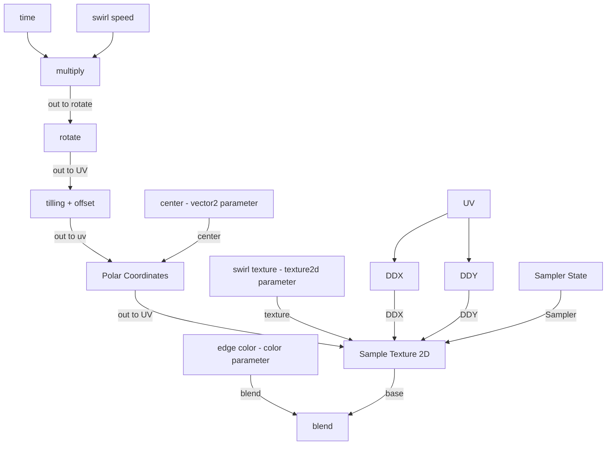
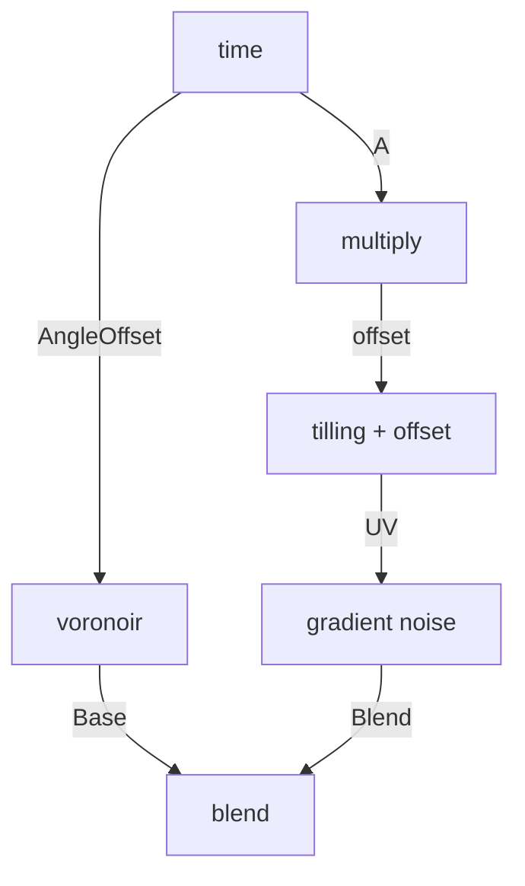
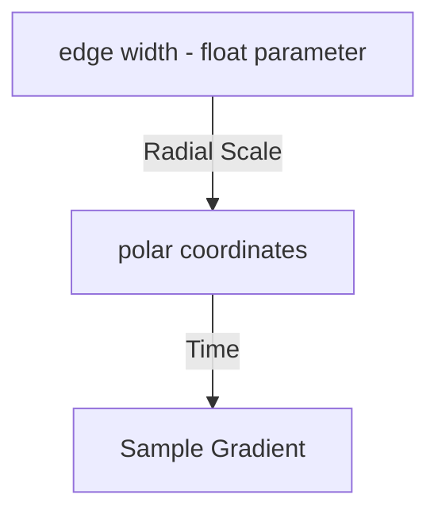
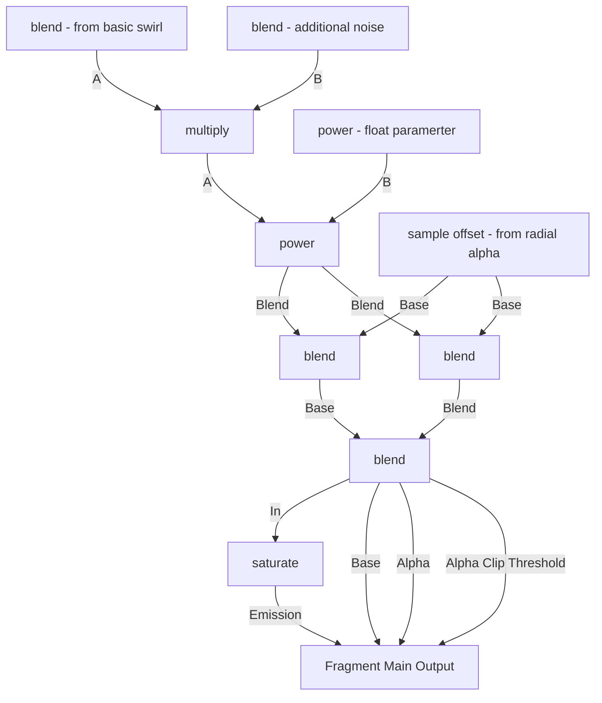

## Basic Swirl Node Structure

```mermaid
graph TD
	A[time] --> B[multiply]
	C[swirl speed] --> B
	B -->|out to rotate| D[rotate]
	D -->|out to UV| E[tilling + offset]
	E -->|out to uv| F[Polar Coordinates]
	G[center - vector2 parameter] -->|center| F
	F -->|out to UV| H[Sample Texture 2D]
	I[swirl texture - texture2d parameter] -->|texture|H
	J[UV] --> K[DDX]
	J --> L[DDY]
	K -->|DDX| H
	L -->|DDY| H
	M[Sampler State] -->|Sampler| H
	N[edge color - color parameter] -->|blend| O[blend]
	H -->|base| O
```

## Additional Noise Textures for the Swirl

```mermaid
graph TD
	A[time] -->|A| B[multiply]
	B -->|offset| C[tilling + offset]
	A -->|AngleOffset| D[voronoir]
	C -->|UV| E[gradient noise]
	D -->|Base| F[blend]
	E -->|Blend| F
```

## Radial Alpha

```mermaid
graph TD
	A[edge width - float parameter] -->|Radial Scale| B[polar coordinates]
	B -->|Time| C[Sample Gradient]
```

## Connecting it all together

```mermaid
graph TD
	A[blend - from basic swirl] -->|A| C[multiply]
	B[blend - additional noise] -->|B| C
	D[power - float paramerter] -->|B| E[power]
	C -->|A| E
	E -->|Blend| F[blend]
	G[sample offset - from radial alpha] -->|Base| F
	G[sample offset - from radial alpha] -->|Base| H[blend]
	E -->|Blend| H
	F -->|Base| I[blend]
	H -->|Blend| I
	J[Fragment Main Output]
	I -->|In| K[saturate]
	K -->|Emission| J
	I -->|Base| J
	I -->|Alpha| J 
	I -->|Alpha Clip Threshold| J
```