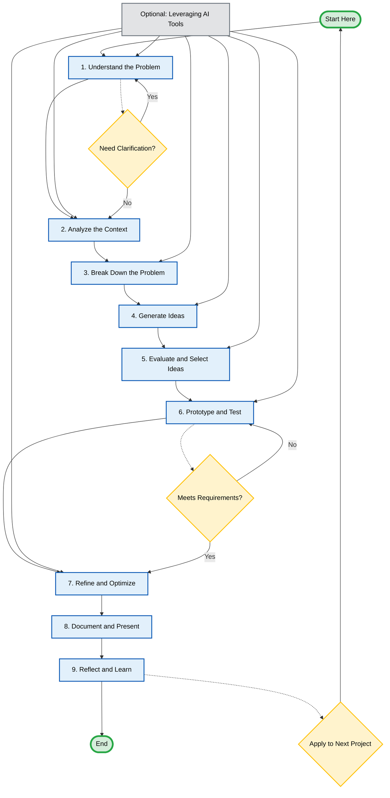

# Critical Thinking and Problem-Solving - A Guide to Learning Better, Faster

> [!summary] 
> ## Introduction
> This guide presents a structured approach to critical thinking and problem-solving, applicable across various fields of study, including technical and creative disciplines. It outlines a step-by-step process designed to enhance your ability to analyze complex problems, generate innovative solutions, and reflect on your learning.
> ### Purpose of this Guide:
> - To provide a systematic method for approaching academic and real-world challenges
> - To develop transferable skills essential for success in any course or professional environment
> - To encourage a mindset of continuous improvement and reflective learning
> ### How to Use This Guide:
> 1. Read through the detailed steps in the main text.
> 2. Apply these steps to your coursework and projects.
> 3. Refer to the visual diagram at the end for a quick overview of the process.
> 4. Revisit and refine your approach as you gain more experience.

> [!attention] Remember
> Critical thinking and problem-solving are skills that improve with practice. Use this guide as a starting point and adapt it to your specific needs and learning style.

---

# The Steps

> [!info] 1. Understand the Problem
> 	- Read the assignment/problem statement thoroughly
> 	- Identify key requirements and constraints
> 	- Restate the problem in your own words
> 	- Ask clarifying questions if needed

> [!info] 2. Analyze the Context
> 	- Research the problem
> 	  - Identify key terms and concepts
> 	  - Use diverse research sources
> 	  - Analyze current techniques
> 	- Examine similar projects
> 	- Consult peers and mentors
> 	- Synthesize your findings

> [!info] 3. Break Down the Problem
> 	- Identify major components
> 	- Create a hierarchy of tasks
> 	- Define sub-tasks

> [!info] 4. Generate Ideas
> 	- Use brainstorming techniques (e.g., mind mapping, sketching)
> 	- Consider multiple approaches
> 	- Defer judgment (focus on quantity over quality)

> [!info] 5. Evaluate and Select Ideas
> 	- Establish evaluation criteria
> 	- Use decision-making tools (e.g., decision matrix)
> 	- Synthesize ideas

> [!info] 6. Prototype and Test
> 	- Create rapid prototypes
> 	- Test incrementally
> 	- Gather and analyze feedback

> [!info] 7. Refine and Optimize
> 	- Prioritize improvements
> 	- Iterate on your implementation
> 	- Optimize performance

> [!info] 8. Document and Present
> 	- Create clear documentation
> 	- Prepare a presentation
> 	- Be ready to discuss your process

> [!info] 9. Reflect and Learn
> 	- Self-evaluate your work
> 	- Seek constructive feedback
> 	- Apply lessons to future work

> [!tip] Optional: Leveraging AI Tools
> 	- Understand AI's capabilities and limitations
> 	- Frame clear and specific questions
> 	- Use AI for brainstorming and ideation
> 	- Seek clarification and elaboration
> 	- Verify and cross-reference information
> 	- Use AI for code review and optimization (if applicable)
> 	- Engage in iterative dialogue
> 	- Combine AI input with your own critical thinking
> 	- Document AI contributions

> [!check] Success
> This process is iterative. Each project is an opportunity to improve your skills and expand your toolkit. Stay curious, be willing to experiment, and learn from both successes and mistakes.

---
# Flow Diagram

---

