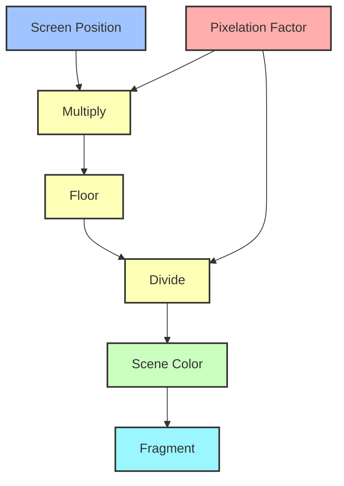

# Tutorial: Creating a Full-Screen Pixelation Effect in Unity

## Objective
In this tutorial guide, you will learn how to create a full-screen pixelation effect using Unity's Shader Graph and Full Screen Pass Renderer Feature.

> [!note] 
> This guide combines shader programming with Unity's SRP to create a custom full sceen effect. It's a great way to understand how different Unity systems work together.

## Prerequisites
- Unity 2022.3 LTS or later with Universal Render Pipeline (URP)
- Basic understanding of Shader Graph and C# scripting

## Part 1: Setting Up Your Project

1. Create a new URP project in Unity Hub.
2. Enable Post-Processing:
   - Go to `Edit > Project Settings > Graphics`
   - Ensure "Post Processing" is enabled under the URP asset settings
3. Add some simple Unity primitives to your scene and give them materials.
1. Add a Global Volume:
   - `Right-click in the Hierarchy > Volume > Global Volume`

## Part 2: Creating the Pixelation Shader

1. Create a new Shader Graph:
   - Right-click in the Project window
   - Select `Create > Shader > URP > Unlit Shader Graph`
   - Name it `PixelationShader`

1. Set up the basic pixelation logic:
   - Add a `Screen Position` node
   - Create a `Float` property named `PixelationFactor` (default: 32).
      - In the Node Settings, change the `Mode` to Slider.
      - Set the `Min` to 8 and the `Max` to 64.
   - Use `Multiply`, `Floor`, and `Divide` nodes to create the pixelation effect:
      - Create a `Multiply` node and plug the Screen Position into one input.
         - We will return to this node shortly.
      - Create a `Floor` node and plug the Multiply into it.
      - Create a `Divide` node and plug the Floor node into its first input.
         - We will return to this node shortly.
      - Create a `Scene Color` node and plug the Divide into it.
      - Plug the Scene Color into the `Base Color` of the Fragment stack.
   - Take the `PixelationFactor` property and plug it into a `Round` node.
      - Plug the Round into the Second input of the `Multiply` and `Divide` nodes from above.

![[pixel1 1.png]]

> [!info] 
> The pixelation effect works by reducing the resolution of the screen sampling. The `PixelationFactor` determines how much we reduce this resolution.

5. Save the Shader Graph

Here's a simplified diagram of the completed node structure:



> [!note] 
> This diagram provides a simplified view of the shader graph. In practice, you may need to add additional nodes for proper depth normalization and UV coordinate handling.

## Part 3: Creating the Pixelation Material

1. Create a new material:
    - Right-click in the Project window
    - Select `Create > Material`
    - Name it `PixelationMaterial`
2. Assign the `PixelationShader` to the material

## Part 4: Implementing the Pixelation Renderer Feature

1. Create a new C# script named `PixelationRendererFeature`
2. Replace the script contents with the following code:

```csharp
using UnityEngine;
using UnityEngine.Rendering;
using UnityEngine.Rendering.Universal;

public class PixelationRendererFeature : ScriptableRendererFeature
{
    class CustomRenderPass : ScriptableRenderPass
    {
        public Material material;
        public float pixelationFactor;

        public override void Execute(ScriptableRenderContext context, ref RenderingData renderingData)
        {
            if (material == null) return;

            material.SetFloat("_PixelationFactor", pixelationFactor);

            CommandBuffer cmd = CommandBufferPool.Get("PixelationEffect");
            Blit(cmd, renderingData.cameraData.renderer.cameraColorTarget, renderingData.cameraData.renderer.cameraColorTarget, material, 0);
            context.ExecuteCommandBuffer(cmd);
            CommandBufferPool.Release(cmd);
        }
    }

    CustomRenderPass m_ScriptablePass;
    public Material pixelationMaterial;

    [Range(8f, 64f)]
    public float pixelationFactor = 32f;

    public override void Create()
    {
        m_ScriptablePass = new CustomRenderPass
        {
            material = pixelationMaterial,
            pixelationFactor = pixelationFactor,
            renderPassEvent = RenderPassEvent.AfterRenderingTransparents
        };
    }

    public override void AddRenderPasses(ScriptableRenderer renderer, ref RenderingData renderingData)
    {
        if (pixelationMaterial == null) return;

        m_ScriptablePass.pixelationFactor = pixelationFactor;
        renderer.EnqueuePass(m_ScriptablePass);
    }
}
```

3. Save the script

> [!important] 
> The `RenderPassEvent.AfterRenderingTransparents` ensures that our pixelation effect is applied after all other rendering is complete, including transparent objects.

> [!note]
> This script creates a custom render pass that applies our pixelation shader to the final rendered image. The `pixelationFactor` can be adjusted in the inspector in real-time to control the resolution of the effect.

## Part 5: Configuring the Renderer Feature

1. In the Project window, locate your URP Renderer Data asset:
   - If you can't find it, create a new one: `Create > Rendering > URP Renderer`
2. Add the `PixelationRendererFeature` to the Renderer Data:
   - Click `Add Renderer Feature` and select PixelationRendererFeature
   - Assign the `PixelationMaterial` to the `Pixelation Material`
- You will also need to add a `Full Screen Pass Render Feature`
	- Click `Add Renderer Feature` and select Full Screen Pass Renderer Feature
		- Set `Injection Point` to Before Render Transparents
		- Set `Requirements` to Color
		- Assign the PixelationMaterial to the `Pass Material`

> [!caution] 
> Ensure that you've assigned the correct material to the Renderer Feature. If left unassigned, the effect won't be visible in your scene.

## Part 6: Testing and Adjusting the Effect

1. With the above steps you should now see the pixelation effect in action
2. Adjust the `PixelationFactor` in the Renderer Feature component to fine-tune the effect

> [!tip]
> You can create a simple script to dynamically change the `pixelationFactor` at runtime for interactive effects. For example, you could tie it to player health or a game event.

## Conclusion

> [!success]
> Congratulations! You've implemented a complex visual effect that can significantly alter the look of your game. This knowledge can be applied to create various other full screen effects using shaders.
